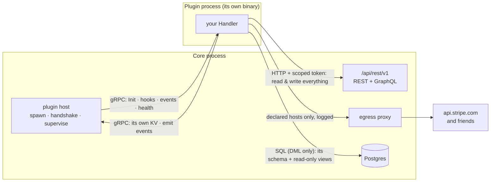

# Nilda Plugin SDK

> The contract Core and every plugin share, and the surface a plugin author actually writes against.
>
> **Status:** built and shipping. Contract **v2** (`nilda.plugin.v2`, `ProtocolVersion = 2`).
>
> Every code example here is real: the types, methods and field names below exist in this module. The
> previous version of this document showed `nilda.ServeApp`, `core.Datastore.DB()`, `core.Routes.Mount()`
> and an `OnContentSaved` handler — none of which ever existed. Someone following it wrote code that did
> not compile. If you find a mismatch between this file and the code, the code is right and this file is a
> bug.

---

## 1. The shape of the system

A plugin is **its own binary, in its own process**. Core spawns it, and they speak gRPC over
`hashicorp/go-plugin`. One rule explains where everything lives:

> **gRPC is how Core calls the plugin. HTTP is how the plugin calls Core.**



Four doors, and each is capability-gated:

| Door | Transport | What it is for | Needs |
|---|---|---|---|
| Core → plugin | gRPC | `Init`, hooks, events, health | — |
| plugin → Core data | **HTTP** to `/api/rest/v1` | read *and write* content, media, taxonomy, menus | a write/read capability |
| plugin → Core state | gRPC | its own KV namespace, emitting events | `kv`, `events` |
| plugin → its tables (Core-owned) | SQL | real transactional data, joins against Core's published data | `datastore` |
| plugin → the internet | HTTP via Core's proxy | payment gateways, SMS, exchanges | a `network` declaration |

---

## 2. Writing a plugin

```go
package main

import (
	"context"

	nilda "gitlab.com/nilda-sdk/plugin-sdk"
)

type Shop struct{ core *nilda.Core }

func main() { nilda.Serve(&Shop{}) }

// Init runs once, after the handshake. Everything the plugin was granted arrives here.
func (s *Shop) Init(ctx context.Context, core *nilda.Core) (nilda.InitResult, error) {
	s.core = core
	return nilda.InitResult{
		Hooks:  []string{"content.saved"}, // requires `hooks`
		Events: []string{"order.paid"},    // requires `events`
		Schedules: []nilda.Schedule{       // requires `schedule`
			{Name: "reminders", Cron: "0 9 * * *"},
		},
		// RouteAddr: addr,                // requires `route` — see §5
	}, nil
}

func (s *Shop) HandleHook(ctx context.Context, hook string, payload []byte) ([]byte, error) {
	// Filter-style: return the payload, modified or not.
	return payload, nil
}

func (s *Shop) HandleEvent(ctx context.Context, eventType string, data []byte) error {
	return nil
}
```

`Handler` is those three methods. There is no `ServeApp` and no second plugin type — an "app" plugin is
just one that declared `route` and `datastore`.

---

## 3. Reading and writing Nilda's data

`core.API()` is an HTTP client already carrying this plugin's scoped token. It talks to the same surface
any external integration talks to, so there is one API to learn and one to maintain.

The base URL is Core's `/api/rest/v1` — the versioned contract of SPEC_73/74, and the only surface that
authenticates API tokens. The content type is part of the PATH.

**Failures worth branching on.** A 429 or a 5xx is retried for you with exponential backoff, honouring
`Retry-After`; a 4xx is not, because repeating it changes nothing.

```go
var apiErr *nilda.APIError
if errors.As(err, &apiErr) {
    apiErr.Forbidden()   // the manifest is missing a capability — a backoff will not fix it
    apiErr.NotFound()
    apiErr.Conflict()
    apiErr.RateLimited()
    apiErr.Code          // Core's own error code, rather than matching on a sentence
}
```

**Writing in bulk?** A `POST` or `PATCH` is never retried automatically, because it may have succeeded
before the response was lost and repeating it would create a second row. Give each unit of work its own
key and it becomes safe:

```go
for _, row := range rows {
    err := api.WithIdempotencyKey(row.ID).Post(ctx, "/content/product", row, nil)
}
```

An importer interrupted at row 312 can then be run again from the start without producing 312 duplicates.
`SetMaxRetries` tunes the patience — a hook runs inside Core's ten-second budget for all subscribers, so
less is sometimes right.

```go
api := s.core.API()

// Create — this is what no plugin could do before contract v2.
// A single resource comes back wrapped in a `data` envelope (SPEC_74).
var created struct {
	Data struct {
		ID       string `json:"id"`
		AuthorID string `json:"author_id"` // this plugin's service account
	} `json:"data"`
}
err := api.Post(ctx, "/content/product", map[string]any{
	"title":  "Blue Widget",
	"status": "draft",
	"values": map[string]any{"sku": "BW-1"},
}, &created)

// Query, with real filters and keyset pagination.
var page struct{ Data []map[string]any `json:"data"` }
err = api.Get(ctx, "/content/product", url.Values{"status": {"published"}}, &page)

// Edit, publish, delete.
id := created.Data.ID
err = api.Patch(ctx, "/content/product/"+id, map[string]any{"title": "Blue Widget v2"}, nil)
err = api.Post(ctx, "/content/product/"+id+"/publish", nil, nil)
err = api.Delete(ctx, "/content/product/"+id)

// Many operations in one round trip — how an importer creates 500 products.
err = api.Post(ctx, "/batch", batchOps, &batchResult)
```

Other resources: `/media`, `/media/:id`, `/users/:id`, `/taxonomies`, `/taxonomies/:key/terms`,
`/terms/:id`, `/menus`, `/site`. GraphQL is at Core's `/api/graphql`.

**Check before you use it.** `core.API()` is `nil` when the manifest declared no capability that grants
API access:

```go
if !core.HasAPI() {
	return nilda.InitResult{}, fmt.Errorf("this plugin needs content.write — add it to the manifest")
}
```

A refusal comes back as `*nilda.APIError` carrying Core's own message, and `Forbidden()` marks the case
whose fix is a manifest change rather than a retry:

```go
var apiErr *nilda.APIError
if errors.As(err, &apiErr) && apiErr.Forbidden() {
	// the token lacks the scope — the manifest is missing a capability
}
```

### Real SQL, when HTTP is the wrong tool

**You declare your tables. Core creates them, and Core owns them.** The data is the site owner's, not
yours — so it outlives your plugin.

```json
"capabilities": ["datastore"],
"tables": [
  {
    "name": "orders",
    "columns": [
      {"name": "id",         "type": "uuid",        "primary_key": true, "default": "gen_random_uuid()"},
      {"name": "content_id", "type": "uuid",        "null": true},
      {"name": "qty",        "type": "int",         "default": "0"},
      {"name": "sku",        "type": "text",        "unique": true, "null": true},
      {"name": "created_at", "type": "timestamptz", "default": "now()"}
    ],
    "indexes": [{"columns": ["content_id"]}]
  }
]
```

Then query it, joined against read-only views over Core's **published** data, in one statement instead of
pulling every row over HTTP:

```sql
SELECT c.title, o.qty
FROM orders o                         -- your table, in your schema, created by Core
JOIN public.core_content c ON c.id = o.content_id
WHERE o.created_at > now() - interval '7 days'
```

**Your role has `SELECT`, `INSERT`, `UPDATE`, `DELETE` — and no DDL at all.** `CREATE TABLE` fails.
`DROP TABLE` fails. `ALTER` fails. Postgres refuses them; this is not a rule you are asked to respect.

Why it works this way: the schema used to be created `AUTHORIZATION <your role>`, which made it yours —
and so uninstalling a shop plugin ran `DROP SCHEMA CASCADE` and destroyed every order the shop had ever
taken. **Uninstalling a plugin must not delete the site's records.** Ownership was the bug.

What that means for you day to day:

- **Adding a column is additive and safe.** Declare it; the next enable runs `ADD COLUMN IF NOT EXISTS`.
  Ship a `default` if you want `NOT NULL`, because a bare `NOT NULL` cannot be added to a populated table.
- **You cannot drop or retype a column.** Nothing in the plugin path emits destructive DDL. Need a
  different shape? Declare a new table and move the rows with the DML you already have.
- **Types are a fixed set**: `uuid`, `text`, `int`, `bigint`, `numeric`, `bool`, `timestamptz`, `date`,
  `jsonb`. Defaults are a fixed set too (`now()`, `gen_random_uuid()`, `'{}'::jsonb`, `true`, `0`, …) plus
  plain numbers and quoted strings. A declaration cannot express `DROP TABLE users`, which is the whole
  reason it is a declaration and not a `.sql` file you ship.
- **`nilda plugin check` validates all of this locally**, naming the exact table and column.

Views, not tables, on Core's side: `core_content`, `core_users`, `core_media`, `core_terms`,
`core_content_terms`. They carry published rows and public columns only — a view cannot apply per-viewer
visibility, so anything whose answer depends on *who is asking* goes through the API, which enforces it
properly. Your role cannot read Core's tables and cannot reach another plugin's schema.

### What happens when a site owner removes your plugin

| | |
|---|---|
| Your process | stopped |
| Your login role | dropped — nothing can connect |
| Your tables and every row | **kept**, owned by Core |
| Your KV namespace | purged (no schema, no export path, nothing an operator could inspect) |
| Content you created in Core | kept, still attributed to your plugin |

The owner sees retained data listed with its real size and can delete it deliberately, by retyping the
plugin key. Reinstalling finds the tables still there.

---

## 4. Capabilities

Declared in the manifest, approved by the site owner at install, enforced by Core on every call.

| Capability | Grants |
|---|---|
| `content.read` / `content.write` | read / create, edit, publish, delete content of any type |
| `media.read` / `media.write` | read / upload and delete media |
| `taxonomy.read` / `taxonomy.write` | read / manage terms |
| `menus.read` / `menus.write` | read / edit navigation |
| `users.read` | read user identity |
| `hooks` | receive hook callbacks |
| `events` | subscribe to and emit events |
| `datastore` | a dedicated Postgres schema, tables Core creates from your declaration, DML-only access |
| `kv` | a scoped key-value namespace |
| `route` | a reverse-proxied URL prefix |
| `render.assets` | load its own scripts on public pages — see §4.1 |
| `widget` | contribute page-builder widgets — see §4.1 |
| `email` | send mail through the site's mailer (Core fixes the sender) |
| `schedule` | ask Core to run recurring work and call back |

That is the whole list. Every entry is dispatched by Core and has a surface in this SDK; there is nothing
to declare that does nothing. `admin.pages` and `payments` used to appear here and were removed in v0.3.0
— neither was ever implemented in Core, so a plugin could be granted them and receive nothing. Declaring
either one now fails validation.

A write capability applies to **every** content type, not a declared subset. What keeps that honest is
attribution, not narrowing: a plugin acts as its own visible service account, so everything it creates or
edits is recorded as its work.

### 4.1 Putting something on a public page

Two capabilities let a plugin reach a page a visitor loads. Both have typed interfaces — implement one and
you never see a hook name or a byte slice.

**`widget` — page-builder widgets.** Implement `nilda.WidgetProvider`:

```go
func (s *Shop) Widgets() []nilda.WidgetDef {
	return []nilda.WidgetDef{{
		Type:  "product-grid", // Core namespaces it as "<your key>.product-grid"
		Label: "Product grid",
		Fields: []nilda.WidgetField{
			{Key: "count", Label: "How many", Type: nilda.FieldNumber, Required: true},
		},
	}}
}

func (s *Shop) RenderWidget(ctx context.Context, req nilda.WidgetRenderRequest) (string, error) {
	return "<ul>…</ul>", nil
}
```

`RenderWidget`'s output is **sanitized** by Core: `<script>`, inline styles, `class`, `nonce` and `data-*`
are stripped. Anything interactive belongs in a script served from your own route, not in this string.
Note what `WidgetRenderRequest` does *not* carry — no user, no session. Rendered pages are cached, so a
widget that varied by viewer would serve one visitor's output to the next.

**`render.assets` — your own script on every page.** Implement `nilda.AssetProvider`:

```go
func (s *Shop) FooterScripts(ctx context.Context, req nilda.RenderAssetsRequest) []nilda.ScriptAsset {
	if req.PageKind == "notfound" {
		return nil
	}
	return []nilda.ScriptAsset{{Src: "/shop/cart.js", Defer: true}}
}
```

A **path**, never markup — Core builds the `<script>` tag itself. `Src` must be root-relative,
same-origin, and under your own declared route prefix, so this capability needs `route` as well: a plugin
that serves no paths owns none. An absolute URL or someone else's prefix is dropped silently.

Implementing `AssetProvider` subscribes you to the hook automatically; you do not list it in `InitResult`.
The widget hooks need no subscription at all — Core asks every plugin holding `widget`.

Core's limits, published as `nilda.MaxWidgetsPerPlugin` (20), `nilda.MaxWidgetHTMLBytes` (64 KiB) and
`nilda.MaxAssetsPerPlugin` (5). Exceeding one is not an error you are told about: the excess is dropped and
logged on Core's side.

---

## 5. Manifest

```json
{
  "key": "shop",
  "name": "Shop",
  "version": "1.0.0",
  "sdk_version": "0.3.0",
  "nilda_compat": ">=0.1.0",
  "capabilities": ["content.write", "media.write", "datastore", "route", "hooks"],
  "route_prefix": "/shop",
  "network": ["api.stripe.com", "*.twilio.com"],
  "os": "linux",
  "arch": "amd64"
}
```

**There is no `signature` field.** It used to live here, over the binary alone — which meant the signature
did not cover the manifest, and the manifest is the thing a site owner approves. A package could have
`content.write` and `network: ["evil.example"]` added in transit and still verify. The signature is now a
detached entry inside the package, over a digest of the manifest AND the binary. See §5.1.

Unknown fields are REFUSED rather than ignored: `"capabilties"` is a typo you want to hear about at your
keyboard, not a plugin that installs with no capabilities and fails at runtime for reasons nobody traces
back to a spelling.

### 5.1 The package

`nilda plugin build` writes one archive per platform, `dist/<key>_<os>_<arch>.nplug`:

```
plugin.json     your manifest, byte for byte as you wrote it
bin/plugin      the executable
signature       the detached publisher signature (present when you built with --sign-key)
```

The signature covers a digest of every entry keyed by its path, with `signature` itself excluded — so
editing the manifest, swapping the binary, or renaming an entry all break it. A signature that lived
inside the manifest could not have covered the manifest, which is the whole reason it is detached.

```sh
nilda plugin build . --sign-key ./signing.key     # or NILDA_SIGN_KEY
```

The key is read from a FILE by default rather than a flag value, because a private key passed on the
command line lands in your shell history and in the process list. Unsigned packages are fine locally; the
marketplace requires a signature, and `nilda plugin check` tells you so before a reviewer does.

`os` and `arch` are the platform this binary was built for. Core refuses a mismatch at install with a
message naming both sides, instead of letting it fail later as an exec error about a bad executable format
— after the install, from software the owner has just chosen to trust. Leave them out and the check is
skipped; the marketplace expects them, because a version there ships one binary per platform.

`network` is the list of external hosts the plugin may reach. The owner reads it at install beside the
capabilities, and Core routes outbound traffic through a proxy that enforces it and logs every attempt.
A wildcard covers one level (`*.twilio.com` matches `api.twilio.com`, not `a.b.twilio.com`); a bare `*` is
refused. Core's own API is always reachable and never declared.

**Use the SDK's client for your own outbound calls**, or the proxy cannot tell whose declaration applies
and refuses them:

```go
client := nilda.HTTPClient(30 * time.Second)  // carries the plugin's identity
res, err := client.Get("https://api.stripe.com/v1/charges")
```

### Recurring work (`schedule`)

Return schedules from `Init` and Core calls back through `HandleHook`:

```go
func (s *Shop) HandleHook(ctx context.Context, hook string, payload []byte) ([]byte, error) {
	if hook == nilda.ScheduleHook("reminders") {
		return payload, s.sendReminders(ctx)
	}
	return payload, nil
}
```

Your process is resident, so you *could* run your own ticker — but a Core-owned schedule is visible to the
site owner, survives a restart, does not double-fire when the plugin is relaunched, and is torn down by an
uninstall. A timer inside your process is none of those things.

A schedule that hangs fails its call and counts toward the same failure budget as a slow content hook.

### Telling the AI agent what you can do (`abilities`)

A hook is the site calling you. An **ability** is the reverse: you telling the site's AI agent that an
action exists, so that when the owner types "add these fifty products" the model has something to call.

Without one, the only actions in the world are the ones Core itself ships. Your plugin can know perfectly
well how to register a product; the agent cannot see that the action exists.

```go
func (s *Shop) Init(ctx context.Context, core *nilda.Core) (nilda.InitResult, error) {
	return nilda.InitResult{
		Abilities: []nilda.Ability{{
			Name:        "create_product",
			Label:       "Create a product",
			Description: "Add a product to the shop. Use when the owner asks to list something for sale.",
			Class:       nilda.ClassWrite,
			InputSchema: nilda.ObjectSchema(map[string]any{
				"title": map[string]any{"type": "string", "description": "The product name."},
				"price": map[string]any{"type": "number"},
			}, "title", "price"),
			Run: s.createProduct,
		}},
	}, nil
}
```

Core turns that into an agent tool named `shop.create_product` — namespaced under your plugin key, so two
plugins can both offer `create_product` without colliding.

**Write the description for the model, not for a colleague.** It is the only thing the agent reads when
deciding whether yours is the right tool for what the owner asked. "Adds a product" is a tool that never
gets called; the version above says *when* to use it.

**Declare the truest `Class`, not the most convenient one.** The class is what Core's guardrails run on:
each connector has a risk ceiling the owner sets, and an ability above it is refused before your plugin is
ever reached. A lower class does not make your action safer — it makes it reachable by connectors the
owner meant to keep on a short leash. A class Core does not recognise is treated as the *most* restricted
one, so a typo costs an owner one permission click rather than an unguarded action.

| Class | For |
|---|---|
| `read` | returns information, changes nothing |
| `additive` | produces a draft or suggestion; nothing goes live |
| `write` | edits live data |
| `publish` | makes something public, or takes it down |
| `structural` | changes the shape of the data model |
| `destructive` | deletes, or acts in bulk |
| `access` | roles, permissions, credentials |
| `infra` | maintenance, caches, backups, the install itself |

`InputSchema` is required and must be a JSON Schema **object** — an agent that cannot see the shape of
your input will call you with the wrong thing. `ObjectSchema` builds one so you do not hand-write JSON.

Set `Run` and the SDK dispatches for you. Leave it nil and the call arrives at your `HandleHook` under
`nilda.AbilityHook("create_product")`; `ability:` is a reserved hook namespace either way.

`abilities` is its **own** capability, separate from `hooks`. Receiving a callback when content changes and
letting a model decide to run one of your actions with no human in the loop are different powers, and the
owner granting the second should be agreeing to exactly that. It appears on their consent screen as
"Offer its actions to an AI agent, which can then run them on your behalf".

### Sending mail (`email`)

```go
err := core.SendEmail(ctx, buyer.Email, "Your order", body)
```

The recipient and the words are yours; the SENDER is Core's. That is deliberate — a plugin can address mail
but never forge who it is from — and it means you need no SMTP credentials of your own, and the owner
configures mail once for the site rather than again for every plugin.

### Serving your own pages (`route`)

```go
func (s *Shop) Init(ctx context.Context, core *nilda.Core) (nilda.InitResult, error) {
	addr, err := nilda.StartHTTP(s.router())  // your own http.Handler
	if err != nil {
		return nilda.InitResult{}, err
	}
	return nilda.InitResult{RouteAddr: addr}, nil
}
```

Core reverse-proxies `/shop/*` to it, so a storefront serves itself without a round trip through Core per
request.

---

## 6. What Core guarantees, and what it does not

**Fault isolation is real.** The plugin is a separate process: a crash, hang, panic or leak cannot take
Core with it. Memory, CPU and disk are capped and the supervisor kills and restarts on breach, disabling a
repeat offender. The child inherits none of Core's environment — no `DATABASE_URL`, no secrets — and holds
no handle to Core's memory or tables.

**It is not a security sandbox**, and the code says so where it is implemented. The child runs as the same
OS user as Core; nothing in-process stops a determined plugin opening a raw socket or reading a file. What
constrains a hostile plugin is the capability gate, the scoped token, the per-plugin database role, the
egress declaration — and, for real enforcement, deployment-level controls documented in Core's
`internal/plugin/egress.go`.

The distinction is stated plainly because the older word for it — "sandbox" — promised something that was
never built, and readers reasonably believed it.

---

## 7. Versioning

`plugin-sdk` is semver. The wire carries a protocol version, Terraform-style: a plugin built against an
incompatible protocol is **rejected at the handshake** with a clear error, never silently broken.

**The signature format is v2, and v1 is not accepted.** v1 signed a single blob and left the manifest
outside the signature. Keeping it acceptable would be a downgrade path — an attacker picks the weakest
format a verifier still honours — so it was removed rather than deprecated. Nothing had been published
under it, so this costs nobody anything.

**Protocol versions are negotiated.** Both sides announce every version they can speak and the handshake
settles on the highest they share (`SupportedProtocols`, go-plugin's `VersionedPlugins`). This is why a
future protocol 3 will not stop your plugin loading the day Core ships it — a Core that speaks 3 also
speaks 2. `nilda plugin check` compares your `sdk_version` against the protocol your Nilda speaks and says
which line of `go.mod` to change, rather than leaving it to surface as a handshake failure on someone
else's server.

**v1 → v2 is breaking.** v1's `HostService` carried five read methods — `ContentSite`,
`ContentPageBySlug`, `ContentList`, `UserByID`, `MediaByID` — and no way to write anything. Between them a
plugin could fetch one page by slug and page through one content type. Porting:

| v1 | v2 |
|---|---|
| `core.Site(ctx)` | `api.Get(ctx, "/site", nil, &out)` |
| `core.PageBySlug(ctx, s)` | `api.Get(ctx, "/content/"+typeKey, url.Values{"slug": {s}}, &out)` |
| `core.ContentList(ctx, t, p, n)` | `api.Get(ctx, "/content/"+t, url.Values{…}, &out)` |
| `core.UserByID(ctx, id)` | `api.Get(ctx, "/users/"+id, nil, &out)` |
| `core.MediaByID(ctx, id)` | `api.Get(ctx, "/media/"+id, nil, &out)` |
| — | `api.Post` / `api.Patch` / `api.Delete`, `/batch`, media upload, GraphQL |

`KVGet/KVSet/KVDel/KVIncr` and `Emit` are unchanged.

---

## 8. The loop

```sh
nilda plugin new shop        # a directory that compiles, with a test that passes
cd shop
go test ./...                # no running Core needed

nilda plugin dev .           # rebuild + reload on every save
nilda plugin trigger content.saved --data '{"title":"x"}'

nilda plugin check .         # the gates Core and the marketplace apply
nilda plugin build .         # every platform, one signed .nplug each, into dist/
nilda plugin publish . --changelog "what changed"
```

**`dev`** watches, rebuilds for your machine, and reloads the plugin in the running Core. It needs a token
with `plugin.manage` (`--token`, or `NILDA_TOKEN`), because reloading means stopping and starting a plugin.
Install the plugin once by hand first; `dev` takes over after that.

**`trigger`** fires one hook — or, with `--event`, one event — at the running plugin, and prints what came
back. Hooks are filter-style, so the response is the thing you are testing. Without this, seeing a
content hook run meant creating real content, and seeing a scheduled callback run meant waiting for the
schedule. Core must have `PLUGIN_DEV_TOOLS=true`; it is off by default.

**`publish`** uploads the built packages and submits the version for review. It reads each artifact's
platform out of the binary inside it, so there are no slots to label and none to mislabel — and the
marketplace reads your capabilities and network hosts out of the manifest inside the package rather than
from anything the CLI typed into a JSON body, so what a reviewer approves is what a site installs. It publishes VERSIONS: the
listing itself — name, summary, screenshots, price — you create once on the web, because those are things you
want to see while setting them.

**Set `PLUGIN_LOG_LEVEL=debug` on Core while developing.** The default is `warn`, and go-plugin routes your
plugin's stdout through that logger — so at the default your own log lines go nowhere and you debug by
guessing.

### Unit tests

`nildatest` is a working fake Core. Everything below runs with `go test` and nothing else.

```go
core, host := nildatest.New("shop", "hooks", "events", "email", "kv")

_, err := p.HandleHook(ctx, "content.saved", payload)

host.Events()   // what the plugin emitted
host.Emails()   // what it asked Core to send
host.KV()       // what it wrote
```

It **enforces capabilities** the same deny-by-default way Core does, so a plugin that quietly relies on
something its manifest never declared fails here rather than on someone else's site. `host.Grant(...)` and
`host.Revoke(...)` let one test cover the before and the after. `host.Fail = err` covers the case nobody
writes: what your plugin does when Core is having a bad day — one that ignores a failed `SendEmail` loses a
customer's receipt with nothing recorded anywhere.

For the API half, `nildatest.NewWithAPI(key, handler, grants...)` points `core.API()` at a test server you
control, so you can assert the requests your plugin makes and choose what comes back — a 403 from a missing
scope and a 500 from an outage are different bugs and a plugin should behave differently for each.

`nilda.NewCoreForTest` still exists for the rare case you want your own host, but prefer `nildatest`: passing
`nil` there gives you a `*Core` whose every host call panics on a nil pointer, and the panic names gRPC
internals rather than the missing dependency.

A worked example lives in `examples/shop` — a plugin that writes content, keeps a counter on a schedule, and
emails a receipt, with the tests to match. **CI compiles and runs it**, which is why the snippets on this page
can be trusted: an SDK change that would make them wrong turns the pipeline red.

---

## 9. Related

- **SPEC_98** (in Core, `docs/files/`) — the plugin runtime: host, capabilities, isolation, lifecycle.
- **SPEC_73/74** — the API this SDK's client calls.
- **SPEC_110** — marketplace distribution. **SPEC_115** — the pre-install security scan.
- **PLUGINS.md** — the plugin catalog.
- **SPEC_114 / `theme-sdk`** — a different thing entirely (headless client SDK); not this.
