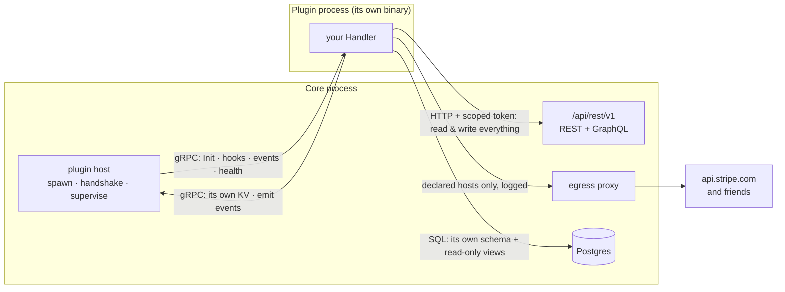

# Nilda Plugin SDK

> The contract Core and every plugin share, and the surface a plugin author actually writes against.
>
> **Status:** built and shipping. Contract **v2** (`nilda.plugin.v2`, `ProtocolVersion = 2`).
>
> Every code example here is real: the types, methods and field names below exist in this module. The
> previous version of this document showed `nilda.ServeApp`, `core.Datastore.DB()`, `core.Routes.Mount()`
> and an `OnContentSaved` handler — none of which ever existed. Someone following it wrote code that did
> not compile. If you find a mismatch between this file and the code, the code is right and this file is a
> bug.

---

## 1. The shape of the system

A plugin is **its own binary, in its own process**. Core spawns it, and they speak gRPC over
`hashicorp/go-plugin`. One rule explains where everything lives:

> **gRPC is how Core calls the plugin. HTTP is how the plugin calls Core.**



Four doors, and each is capability-gated:

| Door | Transport | What it is for | Needs |
|---|---|---|---|
| Core → plugin | gRPC | `Init`, hooks, events, health | — |
| plugin → Core data | **HTTP** to `/api/rest/v1` | read *and write* content, media, taxonomy, menus | a write/read capability |
| plugin → Core state | gRPC | its own KV namespace, emitting events | `kv`, `events` |
| plugin → its own tables | SQL | real transactional data, joins against Core's published data | `datastore` |
| plugin → the internet | HTTP via Core's proxy | payment gateways, SMS, exchanges | a `network` declaration |

---

## 2. Writing a plugin

```go
package main

import (
	"context"
	"encoding/json"

	nilda "gitlab.com/nilda-sdk/plugin-sdk"
)

type Shop struct{ core *nilda.Core }

func main() { nilda.Serve(&Shop{}) }

// Init runs once, after the handshake. Everything the plugin was granted arrives here.
func (s *Shop) Init(ctx context.Context, core *nilda.Core) (nilda.InitResult, error) {
	s.core = core
	return nilda.InitResult{
		Hooks:  []string{"content.saved"}, // requires `hooks`
		Events: []string{"order.paid"},    // requires `events`
		Schedules: []nilda.Schedule{       // requires `schedule`
			{Name: "reminders", Cron: "0 9 * * *"},
		},
		// RouteAddr: addr,                // requires `route` — see §5
	}, nil
}

func (s *Shop) HandleHook(ctx context.Context, hook string, payload []byte) ([]byte, error) {
	// Filter-style: return the payload, modified or not.
	return payload, nil
}

func (s *Shop) HandleEvent(ctx context.Context, eventType string, data []byte) error {
	return nil
}
```

`Handler` is those three methods. There is no `ServeApp` and no second plugin type — an "app" plugin is
just one that declared `route` and `datastore`.

---

## 3. Reading and writing Nilda's data

`core.API()` is an HTTP client already carrying this plugin's scoped token. It talks to the same surface
any external integration talks to, so there is one API to learn and one to maintain.

The base URL is Core's `/api/rest/v1` — the versioned contract of SPEC_73/74, and the only surface that
authenticates API tokens. The content type is part of the PATH.

```go
api := s.core.API()

// Create — this is what no plugin could do before contract v2.
// A single resource comes back wrapped in a `data` envelope (SPEC_74).
var created struct {
	Data struct {
		ID       string `json:"id"`
		AuthorID string `json:"author_id"` // this plugin's service account
	} `json:"data"`
}
err := api.Post(ctx, "/content/product", map[string]any{
	"title":  "Blue Widget",
	"status": "draft",
	"values": map[string]any{"sku": "BW-1"},
}, &created)

// Query, with real filters and keyset pagination.
var page struct{ Data []map[string]any `json:"data"` }
err = api.Get(ctx, "/content/product", url.Values{"status": {"published"}}, &page)

// Edit, publish, delete.
id := created.Data.ID
err = api.Patch(ctx, "/content/product/"+id, map[string]any{"title": "Blue Widget v2"}, nil)
err = api.Post(ctx, "/content/product/"+id+"/publish", nil, nil)
err = api.Delete(ctx, "/content/product/"+id)

// Many operations in one round trip — how an importer creates 500 products.
err = api.Post(ctx, "/batch", batchOps, &batchResult)
```

Other resources: `/media`, `/media/:id`, `/users/:id`, `/taxonomies`, `/taxonomies/:key/terms`,
`/terms/:id`, `/menus`, `/site`. GraphQL is at Core's `/api/graphql`.

**Check before you use it.** `core.API()` is `nil` when the manifest declared no capability that grants
API access:

```go
if !core.HasAPI() {
	return nilda.InitResult{}, fmt.Errorf("this plugin needs content.write — add it to the manifest")
}
```

A refusal comes back as `*nilda.APIError` carrying Core's own message, and `Forbidden()` marks the case
whose fix is a manifest change rather than a retry:

```go
var apiErr *nilda.APIError
if errors.As(err, &apiErr) && apiErr.Forbidden() {
	// the token lacks the scope — the manifest is missing a capability
}
```

### Real SQL, when HTTP is the wrong tool

With `datastore` a plugin gets a dedicated Postgres schema, a scoped role, and a DSN — plus `SELECT` on
read-only views over Core's **published** data. So a query that would otherwise mean pulling every row over
HTTP is one statement:

```sql
SELECT c.title, o.qty
FROM orders o                         -- the plugin's own table, its own schema
JOIN public.core_content c ON c.id = o.content_id
WHERE o.created_at > now() - interval '7 days'
```

Views, not tables: `core_content`, `core_users`, `core_media`, `core_terms`, `core_content_terms`. They
carry published rows and public columns only — a view cannot apply per-viewer visibility, so anything
whose answer depends on *who is asking* goes through the API, which enforces it properly. The plugin's role
cannot read Core's tables, cannot write anywhere outside its own schema, and cannot reach another plugin's.

---

## 4. Capabilities

Declared in the manifest, approved by the site owner at install, enforced by Core on every call.

| Capability | Grants |
|---|---|
| `content.read` / `content.write` | read / create, edit, publish, delete content of any type |
| `media.read` / `media.write` | read / upload and delete media |
| `taxonomy.read` / `taxonomy.write` | read / manage terms |
| `menus.read` / `menus.write` | read / edit navigation |
| `users.read` | read user identity |
| `hooks` | receive hook callbacks |
| `events` | subscribe to and emit events |
| `datastore` | a dedicated Postgres schema + scoped role |
| `kv` | a scoped key-value namespace |
| `route` | a reverse-proxied URL prefix |
| `admin.pages` | admin menu items and pages |
| `render.assets` | load its own scripts on public pages |
| `widget` | contribute page-builder widgets |
| `payments` | the tokenized payments surface |
| `email` | send mail through the site's mailer (Core fixes the sender) |
| `schedule` | ask Core to run recurring work and call back |

A write capability applies to **every** content type, not a declared subset. What keeps that honest is
attribution, not narrowing: a plugin acts as its own visible service account, so everything it creates or
edits is recorded as its work.

---

## 5. Manifest

```json
{
  "key": "shop",
  "name": "Shop",
  "version": "1.0.0",
  "sdk_version": "0.2.0",
  "nilda_compat": ">=0.1.0",
  "capabilities": ["content.write", "media.write", "datastore", "route", "hooks"],
  "route_prefix": "/shop",
  "network": ["api.stripe.com", "*.twilio.com"],
  "os": "linux",
  "arch": "amd64",
  "signature": "v1:<key-id>:<sig>"
}
```

`os` and `arch` are the platform this binary was built for. Core refuses a mismatch at install with a
message naming both sides, instead of letting it fail later as an exec error about a bad executable format
— after the install, from software the owner has just chosen to trust. Leave them out and the check is
skipped; the marketplace expects them, because a version there ships one binary per platform.

`network` is the list of external hosts the plugin may reach. The owner reads it at install beside the
capabilities, and Core routes outbound traffic through a proxy that enforces it and logs every attempt.
A wildcard covers one level (`*.twilio.com` matches `api.twilio.com`, not `a.b.twilio.com`); a bare `*` is
refused. Core's own API is always reachable and never declared.

**Use the SDK's client for your own outbound calls**, or the proxy cannot tell whose declaration applies
and refuses them:

```go
client := nilda.HTTPClient(30 * time.Second)  // carries the plugin's identity
res, err := client.Get("https://api.stripe.com/v1/charges")
```

### Recurring work (`schedule`)

Return schedules from `Init` and Core calls back through `HandleHook`:

```go
func (s *Shop) HandleHook(ctx context.Context, hook string, payload []byte) ([]byte, error) {
	if hook == nilda.ScheduleHook("reminders") {
		return payload, s.sendReminders(ctx)
	}
	return payload, nil
}
```

Your process is resident, so you *could* run your own ticker — but a Core-owned schedule is visible to the
site owner, survives a restart, does not double-fire when the plugin is relaunched, and is torn down by an
uninstall. A timer inside your process is none of those things.

A schedule that hangs fails its call and counts toward the same failure budget as a slow content hook.

### Sending mail (`email`)

```go
err := core.SendEmail(ctx, buyer.Email, "Your order", body)
```

The recipient and the words are yours; the SENDER is Core's. That is deliberate — a plugin can address mail
but never forge who it is from — and it means you need no SMTP credentials of your own, and the owner
configures mail once for the site rather than again for every plugin.

### Serving your own pages (`route`)

```go
func (s *Shop) Init(ctx context.Context, core *nilda.Core) (nilda.InitResult, error) {
	addr, err := nilda.StartHTTP(s.router())  // your own http.Handler
	if err != nil {
		return nilda.InitResult{}, err
	}
	return nilda.InitResult{RouteAddr: addr}, nil
}
```

Core reverse-proxies `/shop/*` to it, so a storefront serves itself without a round trip through Core per
request.

---

## 6. What Core guarantees, and what it does not

**Fault isolation is real.** The plugin is a separate process: a crash, hang, panic or leak cannot take
Core with it. Memory, CPU and disk are capped and the supervisor kills and restarts on breach, disabling a
repeat offender. The child inherits none of Core's environment — no `DATABASE_URL`, no secrets — and holds
no handle to Core's memory or tables.

**It is not a security sandbox**, and the code says so where it is implemented. The child runs as the same
OS user as Core; nothing in-process stops a determined plugin opening a raw socket or reading a file. What
constrains a hostile plugin is the capability gate, the scoped token, the per-plugin database role, the
egress declaration — and, for real enforcement, deployment-level controls documented in Core's
`internal/plugin/egress.go`.

The distinction is stated plainly because the older word for it — "sandbox" — promised something that was
never built, and readers reasonably believed it.

---

## 7. Versioning

`plugin-sdk` is semver. The wire carries a protocol version, Terraform-style: a plugin built against an
incompatible protocol is **rejected at the handshake** with a clear error, never silently broken.

**v1 → v2 is breaking.** v1's `HostService` carried five read methods — `ContentSite`,
`ContentPageBySlug`, `ContentList`, `UserByID`, `MediaByID` — and no way to write anything. Between them a
plugin could fetch one page by slug and page through one content type. Porting:

| v1 | v2 |
|---|---|
| `core.Site(ctx)` | `api.Get(ctx, "/site", nil, &out)` |
| `core.PageBySlug(ctx, s)` | `api.Get(ctx, "/content/"+typeKey, url.Values{"slug": {s}}, &out)` |
| `core.ContentList(ctx, t, p, n)` | `api.Get(ctx, "/content/"+t, url.Values{…}, &out)` |
| `core.UserByID(ctx, id)` | `api.Get(ctx, "/users/"+id, nil, &out)` |
| `core.MediaByID(ctx, id)` | `api.Get(ctx, "/media/"+id, nil, &out)` |
| — | `api.Post` / `api.Patch` / `api.Delete`, `/batch`, media upload, GraphQL |

`KVGet/KVSet/KVDel/KVIncr` and `Emit` are unchanged.

---

## 8. The loop

```sh
nilda plugin new shop        # a directory that compiles, with a test that passes
cd shop
go test ./...                # no running Core needed

nilda plugin dev .           # rebuild + reload on every save
nilda plugin trigger content.saved --data '{"title":"x"}'

nilda plugin check .         # the gates Core and the marketplace apply
nilda plugin build .         # every platform + one manifest, into dist/
nilda plugin publish . --changelog "what changed"
```

**`dev`** watches, rebuilds for your machine, and reloads the plugin in the running Core. It needs a token
with `plugin.manage` (`--token`, or `NILDA_TOKEN`), because reloading means stopping and starting a plugin.
Install the plugin once by hand first; `dev` takes over after that.

**`trigger`** fires one hook — or, with `--event`, one event — at the running plugin, and prints what came
back. Hooks are filter-style, so the response is the thing you are testing. Without this, seeing a
content hook run meant creating real content, and seeing a scheduled callback run meant waiting for the
schedule. Core must have `PLUGIN_DEV_TOOLS=true`; it is off by default.

**`publish`** uploads the built binaries and submits the version for review. It reads each artifact's
platform out of the file, so there are no slots to label and none to mislabel. It publishes VERSIONS: the
listing itself — name, summary, screenshots, price — you create once on the web, because those are things you
want to see while setting them.

**Set `PLUGIN_LOG_LEVEL=debug` on Core while developing.** The default is `warn`, and go-plugin routes your
plugin's stdout through that logger — so at the default your own log lines go nowhere and you debug by
guessing.

### Unit tests

`nildatest` is a working fake Core. Everything below runs with `go test` and nothing else.

```go
core, host := nildatest.New("shop", "hooks", "events", "email", "kv")

_, err := p.HandleHook(ctx, "content.saved", payload)

host.Events()   // what the plugin emitted
host.Emails()   // what it asked Core to send
host.KV()       // what it wrote
```

It **enforces capabilities** the same deny-by-default way Core does, so a plugin that quietly relies on
something its manifest never declared fails here rather than on someone else's site. `host.Grant(...)` and
`host.Revoke(...)` let one test cover the before and the after. `host.Fail = err` covers the case nobody
writes: what your plugin does when Core is having a bad day — one that ignores a failed `SendEmail` loses a
customer's receipt with nothing recorded anywhere.

For the API half, `nildatest.NewWithAPI(key, handler, grants...)` points `core.API()` at a test server you
control, so you can assert the requests your plugin makes and choose what comes back — a 403 from a missing
scope and a 500 from an outage are different bugs and a plugin should behave differently for each.

`nilda.NewCoreForTest` still exists for the rare case you want your own host, but prefer `nildatest`: passing
`nil` there gives you a `*Core` whose every host call panics on a nil pointer, and the panic names gRPC
internals rather than the missing dependency.

A worked example lives in `examples/shop` — a plugin that writes content, keeps a counter on a schedule, and
emails a receipt, with the tests to match. **CI compiles and runs it**, which is why the snippets on this page
can be trusted: an SDK change that would make them wrong turns the pipeline red.

---

## 9. Related

- **SPEC_98** (in Core, `docs/files/`) — the plugin runtime: host, capabilities, isolation, lifecycle.
- **SPEC_73/74** — the API this SDK's client calls.
- **SPEC_110** — marketplace distribution. **SPEC_115** — the pre-install security scan.
- **PLUGINS.md** — the plugin catalog.
- **SPEC_114 / `theme-sdk`** — a different thing entirely (headless client SDK); not this.
