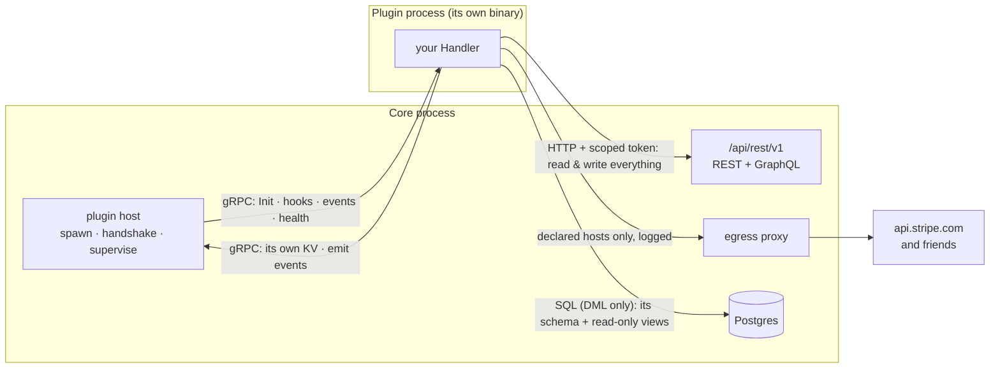

> **Not writing Go?** You do not have to. Nilda talks to plugins over gRPC, which is not a Go idea — see
> [ANY_LANGUAGE.md](ANY_LANGUAGE.md) for the whole contract: the handshake, AutoMTLS, the proto, and a
> working Python sketch. This guide is the Go SDK, which hides all of it.

# Nilda Plugin SDK

> The contract Core and every plugin share, and the surface a plugin author actually writes against.
>
> **Status:** built and shipping. Contract **v2** (`nilda.plugin.v2`, `ProtocolVersion = 2`).
>
> Every code example here is real: the types, methods and field names below exist in this module. The
> previous version of this document showed `nilda.ServeApp`, `core.Datastore.DB()`, `core.Routes.Mount()`
> and an `OnContentSaved` handler — none of which ever existed. Someone following it wrote code that did
> not compile. If you find a mismatch between this file and the code, the code is right and this file is a
> bug.

---

## 1. The shape of the system

A plugin is **its own binary, in its own process**. Core spawns it, and they speak gRPC over
`hashicorp/go-plugin`. One rule explains where everything lives:

> **gRPC is how Core calls the plugin. HTTP is how the plugin calls Core.**



Four doors, and each is capability-gated:

| Door | Transport | What it is for | Needs |
|---|---|---|---|
| Core → plugin | gRPC | `Init`, hooks, events, health | — |
| plugin → Core data | **HTTP** to `/api/rest/v1` | read *and write* content, media, taxonomy, menus | a write/read capability |
| plugin → Core state | gRPC | its own KV namespace, emitting events | `kv`, `events` |
| plugin → its tables (Core-owned) | SQL | real transactional data, joins against Core's published data | `datastore` |
| plugin → the internet | HTTP via Core's proxy | payment gateways, SMS, exchanges | a `network` declaration |

---

## 2. Writing a plugin

```go
package main

import (
	"context"

	nilda "gitlab.com/nildalabs/nilda-sdk/plugin-sdk"
)

type Shop struct{ core *nilda.Core }

func main() { nilda.Serve(&Shop{}) }

// Init runs once, after the handshake. Everything the plugin was granted arrives here.
func (s *Shop) Init(ctx context.Context, core *nilda.Core) (nilda.InitResult, error) {
	s.core = core
	return nilda.InitResult{
		Hooks:  []string{"content.saved"}, // requires `hooks`
		Events: []string{"order.paid"},    // requires `events`
		Schedules: []nilda.Schedule{       // requires `schedule`
			{Name: "reminders", Cron: "0 9 * * *"},
		},
		// RouteAddr: addr,                // requires `route` — see §5
	}, nil
}

func (s *Shop) HandleHook(ctx context.Context, hook string, payload []byte) ([]byte, error) {
	// Filter-style: return the payload, modified or not.
	return payload, nil
}

func (s *Shop) HandleEvent(ctx context.Context, eventType string, data []byte) error {
	return nil
}
```

`Handler` is those three methods. There is no `ServeApp` and no second plugin type — an "app" plugin is
just one that declared `route` and `datastore`.

---

## 3. Reading and writing Nilda's data

`core.API()` is an HTTP client already carrying this plugin's scoped token. It talks to the same surface
any external integration talks to, so there is one API to learn and one to maintain.

The base URL is Core's `/api/rest/v1` — the versioned contract of SPEC_73/74, and the only surface that
authenticates API tokens. The content type is part of the PATH.

**Failures worth branching on.** A 429 or a 5xx is retried for you with exponential backoff, honouring
`Retry-After`; a 4xx is not, because repeating it changes nothing.

```go
var apiErr *nilda.APIError
if errors.As(err, &apiErr) {
    apiErr.Forbidden()   // the manifest is missing a capability — a backoff will not fix it
    apiErr.NotFound()
    apiErr.Conflict()
    apiErr.RateLimited()
    apiErr.Code          // Core's own error code, rather than matching on a sentence
}
```

**Writing in bulk?** A `POST` or `PATCH` is never retried automatically, because it may have succeeded
before the response was lost and repeating it would create a second row. Give each unit of work its own
key and it becomes safe:

```go
for _, row := range rows {
    err := api.WithIdempotencyKey(row.ID).Post(ctx, "/content/product", row, nil)
}
```

An importer interrupted at row 312 can then be run again from the start — within 24 hours — without
producing 312 duplicates. Core keeps the FIRST result for each key and hands it back to every repeat of the
same request (marked `Idempotent-Replayed: true`), errors included, so a retry after a 5xx cannot write
twice. The same key on a different request is refused (422); a repeat while the first is still running is
refused (409); a request Core refused (4xx) gives its key back. Keys belong to your plugin's identity, not
its token, so they survive a restart.

`WithMaxRetries` tunes the patience — a hook runs inside Core's ten-second budget for all subscribers, so
less is sometimes right.

```go
api := s.core.API()

// Create — this is what no plugin could do before contract v2.
// A single resource comes back wrapped in a `data` envelope (SPEC_74).
var created struct {
	Data struct {
		ID       string `json:"id"`
		AuthorID string `json:"author_id"` // this plugin's service account
	} `json:"data"`
}
err := api.Post(ctx, "/content/product", map[string]any{
	"title":  "Blue Widget",
	"status": "draft",
	"values": map[string]any{"sku": "BW-1"},
}, &created)

// Query, with real filters and keyset pagination.
var page struct{ Data []map[string]any `json:"data"` }
err = api.Get(ctx, "/content/product", url.Values{"status": {"published"}}, &page)

// Edit, publish, delete.
id := created.Data.ID
err = api.Patch(ctx, "/content/product/"+id, map[string]any{"title": "Blue Widget v2"}, nil)
err = api.Post(ctx, "/content/product/"+id+"/publish", nil, nil)
err = api.Delete(ctx, "/content/product/"+id)

// Many operations in one round trip — how an importer creates 500 products.
err = api.Post(ctx, "/batch", batchOps, &batchResult)
```

Other resources: `/media`, `/media/:id`, `/users/:id`, `/taxonomies`, `/taxonomies/:key/terms`,
`/terms/:id`, `/menus`, `/site`. GraphQL is at Core's `/api/graphql`.

A file goes into the media library with `api.UploadMedia` (needs `media.write`) — `POST /media` takes a
multipart upload, not JSON, so `api.Post` cannot send one:

```go
var up struct{ Data struct{ ID string `json:"id"` } `json:"data"` }
err = api.UploadMedia(ctx, "kettle.jpg", file, "A copper kettle", &up)
```

**Check before you use it.** `core.API()` is `nil` when the manifest declared no capability that grants
API access:

```go
if !core.HasAPI() {
	return nilda.InitResult{}, fmt.Errorf("this plugin needs content.write — add it to the manifest")
}
```

A refusal comes back as `*nilda.APIError` carrying Core's own message, and `Forbidden()` marks the case
whose fix is a manifest change rather than a retry:

```go
var apiErr *nilda.APIError
if errors.As(err, &apiErr) && apiErr.Forbidden() {
	// the token lacks the scope — the manifest is missing a capability
}
```

### Real SQL, when HTTP is the wrong tool

**You declare your tables. Core creates them, and Core owns them.** The data is the site owner's, not
yours — so it outlives your plugin.

```json
"capabilities": ["datastore"],
"tables": [
  {
    "name": "orders",
    "columns": [
      {"name": "id",         "type": "uuid",        "primary_key": true, "default": "gen_random_uuid()"},
      {"name": "content_id", "type": "uuid",        "null": true},
      {"name": "qty",        "type": "int",         "default": "0"},
      {"name": "sku",        "type": "text",        "unique": true, "null": true},
      {"name": "created_at", "type": "timestamptz", "default": "now()"}
    ],
    "indexes": [{"columns": ["content_id"]}]
  }
]
```

Then query it, joined against read-only views over Core's **published** data, in one statement instead of
pulling every row over HTTP:

```sql
SELECT c.title, o.qty
FROM orders o                         -- your table, in your schema, created by Core
JOIN public.core_content c ON c.id = o.content_id
WHERE o.created_at > now() - interval '7 days'
```

**Your role has `SELECT`, `INSERT`, `UPDATE`, `DELETE` — and no DDL at all.** `CREATE TABLE` fails.
`DROP TABLE` fails. `ALTER` fails. Postgres refuses them; this is not a rule you are asked to respect.

Why it works this way: the schema used to be created `AUTHORIZATION <your role>`, which made it yours —
and so uninstalling a shop plugin ran `DROP SCHEMA CASCADE` and destroyed every order the shop had ever
taken. **Uninstalling a plugin must not delete the site's records.** Ownership was the bug.

What that means for you day to day:

- **Adding a column is additive and safe.** Declare it; the next enable adds it. Ship a `default` if you
  want `NOT NULL`, because a bare `NOT NULL` cannot be added to a populated table.
- **You cannot drop or retype a column, or move the primary key.** Nothing in the plugin path emits
  destructive DDL, and an update that marks a different column `primary_key` is refused before anything
  changes. Need a different shape? Declare a new table and move the rows with the DML you already have.
- **A new unique column or index must fit the rows already there.** An update whose new unique column or
  index would put two existing rows on one value — a new unique column whose `default` gives every row the
  same value, say — is refused before anything changes, naming the table.
- **The site keeps working while your tables change.** Core adds only the columns a table does not have
  yet, and builds an index `CONCURRENTLY`, after the table statements commit — so a new index on a
  populated table does not hold the site's writes to it while it builds.
- **Types are a fixed set**: `uuid`, `text`, `int`, `bigint`, `numeric`, `bool`, `timestamptz`, `date`,
  `jsonb`. Defaults are a fixed set too (`now()`, `gen_random_uuid()`, `'{}'::jsonb`, `true`, `0`, …) plus
  plain numbers and quoted strings. A declaration cannot express `DROP TABLE users`, which is the whole
  reason it is a declaration and not a `.sql` file you ship.
- **A default must fit its column**, by Postgres's own rule: a `text` column takes any default; `now()` fits
  `timestamptz` and `date`, `gen_random_uuid()` fits `uuid`, `true`/`false` fit `bool`, a plain number fits
  `int`, `bigint` and `numeric`; a quoted string must be a value of the column's type (`'42'` on an `int`,
  `'yes'` on a `bool`). A quoted date or time is left to Postgres, which reads too many spellings of one to
  restate — a wrong one still fails when the table is built.
- **Limits**: at most 64 tables, 64 columns a table, 16 indexes a table and 32 columns an index (Postgres
  builds no wider). No column may take the name of a column Postgres keeps on every table (`tableoid`,
  `xmin`, `cmin`, `xmax`, `cmax`, `ctid`).
- **Index names are Core's**: `<table>_<columns>_idx` (`_uniq` for a unique one), so `gateway` indexing
  `txn_ref` and `gateway_txn` indexing `ref` would share a name, and so would an index and a table called
  what it would be called. Either is refused, naming both declarations — one of the two would otherwise
  never be built.
- **`nilda plugin check` validates all of this locally**, naming the exact table and column.

### Your own content types and taxonomies

A shop's products, a booking plugin's services and their categories are **Core content**, not rows in your
tables: they get an archive page, a slug, SEO and a sitemap entry for free, and they outlive your plugin.
Declare them, and Core creates them on every enable — additively, never deleting or retyping a field:

```json
"capabilities": ["content.write", "taxonomy.write"],
"content_types": [{"key": "shop_product", "label": "Products", "fields": [
  {"key": "price", "label": "Price", "type": "number"}
]}],
"taxonomies": [{"key": "shop_category", "label": "Categories", "hierarchical": true,
  "applies_to": ["shop_product"]}]
```

- **Namespaced by your plugin's key.** Every key starts with `<key>_`. A content type key is at most 40
  characters — the content-type registry's own bound — and a taxonomy key at most 60.
- **Bounded**: at most 8 content types of at most 48 fields each, and 8 taxonomies, each attached to between
  1 and 32 content types (`applies_to` is required: a taxonomy attached to nothing is a tree nobody can use).
- **Owned by whoever created it.** A second plugin declaring a key you created is refused by name — and so
  is it after you are uninstalled, because the type and its items stay with the site: the refusal says to
  reinstall you, or to delete the type first. Where two plugins' keys overlap (`shop` and `shop_widgets`), a
  key under both belongs to the longer: `shop_widgets_gadget` is `shop_widgets`'s, whoever installed first.

Views, not tables, on Core's side: `core_content`, `core_users`, `core_media`, `core_terms`,
`core_content_terms`. They carry published rows and public columns only — a view cannot apply per-viewer
visibility, so anything whose answer depends on *who is asking* goes through the API, which enforces it
properly. Your role cannot read Core's tables and cannot reach another plugin's schema.

### What happens when a site owner removes your plugin

| | |
|---|---|
| Your process | stopped |
| Your login role | dropped — nothing can connect |
| Your tables and every row | **kept**, owned by Core |
| Your KV namespace | purged (no schema, no export path, nothing an operator could inspect) |
| Content you created in Core | kept, still attributed to your plugin |

The owner sees retained data listed with its real size and can delete it deliberately, by retyping the
plugin key. Reinstalling finds the tables still there.

---

## 4. Capabilities

Declared in the manifest, approved by the site owner at install, enforced by Core on every call.

| Capability | Grants |
|---|---|
| `content.read` / `content.write` | read / create, edit, publish, delete content of any type |
| `media.read` / `media.write` | read / upload and delete media |
| `taxonomy.read` / `taxonomy.write` | read / manage terms |
| `menus.read` / `menus.write` | read / edit navigation |
| `users.read` | read user identity |
| `hooks` | receive hook callbacks |
| `events` | subscribe to events, and emit your own — see below for which names are yours |
| `datastore` | a dedicated Postgres schema, tables Core creates from your declaration, DML-only access |
| `kv` | a scoped key-value namespace for small state: a value is at most 64 KiB, and on a Lite install (where it lives in Core's memory) one plugin holds at most 10,000 keys and 16 MiB — past that a write answers `ResourceExhausted`; declare `datastore` for more |
| `route` | a reverse-proxied URL prefix |
| `render.assets` | load its own scripts on public pages — see §4.1 |
| `widget` | contribute page-builder widgets — see §4.1 |
| `email` | send mail through the site's mailer (Core fixes the sender) |
| `schedule` | ask Core to run recurring work and call back |
| `abilities` | offer your actions to the site's AI agent — see §4.2 |
| `admin_page` | your own section of the admin sidebar: settings forms and list pages — see §5 |
| `field` | contribute a kind of field to content types and forms — see §5 |
| `auth_provider` | put a sign-in button on the login page — see §5 |
| `search_provider` | be the site's search engine — see §5 |
| `commerce` | be the site's shop: supply the products, prices and cart the storefront widgets draw — see §5 |

That is the whole list. Every entry is dispatched by Core and has a surface in this SDK; there is nothing
to declare that does nothing. `admin.pages` and `payments` used to appear here and were removed in v0.3.0
— neither was ever implemented in Core, so a plugin could be granted them and receive nothing. Declaring
either one now fails validation.

**There is no payment capability YET — a Core contract is decided, not built** (Nilda's D-84, 2026-09-23).
Every gateway (Stripe, PayPal, …) will be its own plugin declaring `payment_gateway`, and whatever takes the
money — the shop, a booking deposit, a donation — will declare `payment_session` and talk only to Core,
which routes each payment to the gateway the site uses. Plugins never call each other. Until that ships, a
separate plugin cannot be a payment gateway at all: the shop's own `PaymentGateway` is an interface inside
the shop's process, which no other plugin can implement. What works today: to take one payment from one
page — an ebook, a donation, a deposit — the site owner drops a PayPal or Stripe button widget in the page
builder, with no plugin involved. The names `payment` and `payments` stay refused, so a manifest cannot
claim a capability before it exists.

A write capability applies to **every** content type, not a declared subset. What keeps that honest is
attribution, not narrowing: a plugin acts as its own visible service account, so everything it creates or
edits is recorded as its work.

**An event you emit is named for you.** `events` lets a plugin emit, and Core checks the NAME: yours start
with your key — `shop` emits `shop.order_paid`, which `core.PluginKey + ".order_paid"` builds — or with a
namespace a capability you hold owns: `commerce.*` belongs to the site's shop, the plugin holding
`commerce`, whoever wrote it. Any other name is refused with `PermissionDenied`, and Core's own names
(`content.*`, `form.*`, `comment.*`, …) are refused to every plugin, even one keyed `content`. The reason
is the subscriber: a plugin listening for an order event has nothing but the name to tell it who sent it,
so a name anyone could use would let one plugin announce an order nobody paid. `nildatest` refuses the same
names — all but Core's own, which it cannot know — so a wrong one fails your tests first.

### 4.1 Putting something on a public page

Two capabilities let a plugin reach a page a visitor loads. Both have typed interfaces — implement one and
you never see a hook name or a byte slice.

**`widget` — page-builder widgets.** Implement `nilda.WidgetProvider`:

```go
func (s *Shop) Widgets() []nilda.WidgetDef {
	return []nilda.WidgetDef{{
		Type:  "product-grid", // Core namespaces it as "<your key>.product-grid"
		Label: "Product grid",
		Fields: []nilda.WidgetField{
			{Key: "count", Label: "How many", Type: nilda.FieldNumber, Required: true},
		},
	}}
}

func (s *Shop) RenderWidget(ctx context.Context, req nilda.WidgetRenderRequest) (string, error) {
	return "<ul>…</ul>", nil
}
```

`RenderWidget`'s output is **sanitized** by Core with its component policy: `<script>`, `<iframe>`, `on*`
handlers, `javascript:` URLs and the `style` attribute are removed; `class` and `data-*` are **kept**, so the
theme can style your markup and your script can find it. Anything that runs belongs in a script served from
your own route, not in this string.
Note what `WidgetRenderRequest` does *not* carry — no user, no session. Rendered pages are cached, so a
widget that varied by viewer would serve one visitor's output to the next.

**`render.assets` — your own script on every page.** Implement `nilda.AssetProvider`:

```go
func (s *Shop) FooterScripts(ctx context.Context, req nilda.RenderAssetsRequest) []nilda.ScriptAsset {
	if req.PageKind == "notfound" {
		return nil
	}
	return []nilda.ScriptAsset{{Src: "/shop/cart.js", Defer: true}}
}
```

A **path**, never markup — Core builds the `<script>` tag itself. `Src` must be root-relative,
same-origin, and under your own declared route prefix, so this capability needs `route` as well — Core
refuses a manifest that declares `render.assets` without it, because a plugin that serves no paths owns
none. An absolute URL or someone else's prefix is dropped silently.

Implementing `AssetProvider` subscribes you to the hook automatically; you do not list it in `InitResult`.
The widget hooks need no subscription at all — Core asks every plugin holding `widget`.

Core's limits, published as `nilda.MaxWidgetsPerPlugin` (20), `nilda.MaxWidgetHTMLBytes` (64 KiB) and
`nilda.MaxAssetsPerPlugin` (5). Past a count, the excess is dropped and logged on Core's side.

What one `DescribeWidgets` answer may carry is bounded too: 1 MiB for the whole answer, and in one widget
at most 200 fields — counted at every level, a repeater's sub-fields included — with at most 200 choices and
50 rows in any one field. A widget past a bound is not offered at all (logged on Core's side, like the rest),
and an answer past 1 MiB offers none.

A render over `MaxWidgetHTMLBytes` is treated like an error from `RenderWidget`: nothing on a visitor's page,
and on the editor's canvas a box saying the widget could not be shown, so an author is not sent to fill in
settings that were never the problem.

---

## 5. Manifest

```json
{
  "key": "shop",
  "name": "Shop",
  "version": "1.0.0",
  "sdk_version": "0.3.0",
  "nilda_compat": ">=0.1.0",
  "capabilities": ["content.write", "media.write", "datastore", "route", "hooks"],
  "route_prefix": "/shop",
  "network": ["api.stripe.com", "*.twilio.com"],
  "os": "linux",
  "arch": "amd64"
}
```

**There is no `signature` field.** It used to live here, over the binary alone — which meant the signature
did not cover the manifest, and the manifest is the thing a site owner approves. A package could have
`content.write` and `network: ["evil.example"]` added in transit and still verify. The signature now lives
in a separate file BESIDE the package, over the package's own bytes — and the manifest is inside those
bytes, so it is covered. See §5.1.

An unknown field is REFUSED by `nilda plugin check`: `"capabilties"` is a typo you want to hear about at
your keyboard, not a plugin that installs with no capabilities and fails at runtime for reasons nobody
traces back to a spelling. An INSTALL tolerates one, so a package built for a newer Nilda still installs on
an older one with what that version understands — and the owner is told which fields were ignored, by path
at any depth (`tables[].columns[].collation`), beside the install's success.

`version` is semver without leading zeros: `1.09.0` is refused, because it would compare equal to `1.9.0`
and an update to either could be turned away as not newer. An update must be strictly newer than what is
installed.

### 5.1 The package

`nilda plugin build` writes one archive per platform, `dist/<key>_<os>_<arch>.nplug`, holding exactly two
entries — Core's installer refuses any other:

```
plugin.json     your manifest, byte for byte as you wrote it
bin/plugin      the executable
```

When you build with `--sign-key`, the publisher signature is written BESIDE the archive as
`dist/<key>_<os>_<arch>.nplug.sig`, over the archive file's own bytes. Editing the manifest, swapping the
binary or renaming an entry changes those bytes, so all of them break it — and neither side needs a digest
scheme the other must reproduce. A `signature` entry INSIDE the archive is refused at install: a signature
cannot cover the file that contains it.

```sh
nilda plugin build . --sign-key ./signing.key     # or NILDA_SIGN_KEY
```

The key is read from a FILE by default rather than a flag value, because a private key passed on the
command line lands in your shell history and in the process list. Unsigned packages are fine locally; the
marketplace requires a signature, and `nilda plugin check` tells you so before a reviewer does.

`os` and `arch` are the platform this binary was built for. Core refuses a mismatch at install with a
message naming both sides, instead of letting it fail later as an exec error about a bad executable format
— after the install, from software the owner has just chosen to trust. Leave them out and the check is
skipped; the marketplace expects them, because a version there ships one binary per platform.

`network` is the list of external hosts the plugin may reach — at most 32. The owner reads it at install
beside the capabilities — and on the plugin's row afterwards — and Core routes outbound traffic through a
proxy that enforces it and writes every attempt to the server's log. A wildcard covers one level (`*.twilio.com`
matches `api.twilio.com`, not `a.b.twilio.com`); a bare `*` is refused, and so is a wildcard over a public
suffix — `*.com`, `*.co.uk`, `*.github.io` — because those reach every site anybody registers there. Core's
own API is always reachable and never declared.

**Any client that honours `HTTPS_PROXY` is identified**: the proxy address Core hands your process carries
your plugin's key, so a bare `http.Client{}`, a wrapped transport or a plugin in another language is known
to the proxy by it. The SDK's client is the one already set up for it:

```go
client := nilda.HTTPClient(30 * time.Second)  // carries the plugin's identity
res, err := client.Get("https://api.stripe.com/v1/charges")
```

**Connections are bounded.** A plugin holds at most 64 connections through the proxy at once — the next one
is refused with a 503 rather than queued — and a tunnel nothing crosses, in either direction, for 10 minutes
is closed. A pooled client stays far inside both; a plugin that opens a connection per request and never
closes it does not.

### Recurring work (`schedule`)

Return schedules from `Init` and Core calls back through `HandleHook`:

```go
func (s *Shop) HandleHook(ctx context.Context, hook string, payload []byte) ([]byte, error) {
	if hook == nilda.ScheduleHook("reminders") {
		return payload, s.sendReminders(ctx)
	}
	return payload, nil
}
```

Your process is resident, so you *could* run your own ticker — but a Core-owned schedule is visible to the
site owner, survives a restart, does not double-fire when the plugin is relaunched, and is torn down by an
uninstall. A timer inside your process is none of those things.

A schedule that hangs fails its call and counts toward the same failure budget as a slow content hook.

### Telling the AI agent what you can do (`abilities`)

A hook is the site calling you. An **ability** is the reverse: you telling the site's AI agent that an
action exists, so that when the owner types "add these fifty products" the model has something to call.

Without one, the only actions in the world are the ones Core itself ships. Your plugin can know perfectly
well how to register a product; the agent cannot see that the action exists.

```go
func (s *Shop) Init(ctx context.Context, core *nilda.Core) (nilda.InitResult, error) {
	return nilda.InitResult{
		Abilities: []nilda.Ability{{
			Name:        "create_product",
			Label:       "Create a product",
			Description: "Add a product to the shop. Use when the owner asks to list something for sale.",
			Class:       nilda.ClassWrite,
			InputSchema: nilda.ObjectSchema(map[string]any{
				"title": map[string]any{"type": "string", "description": "The product name."},
				"price": map[string]any{"type": "number"},
			}, "title", "price"),
			Run: s.createProduct,
		}},
	}, nil
}
```

Core turns that into an agent tool named `shop.create_product` — namespaced under your plugin key, so two
plugins can both offer `create_product` without colliding.

**Write the description for the model, not for a colleague.** It is the only thing the agent reads when
deciding whether yours is the right tool for what the owner asked. "Adds a product" is a tool that never
gets called; the version above says *when* to use it.

**Declare the truest `Class`, not the most convenient one.** The class is what Core's guardrails run on:
each connector has a risk ceiling the owner sets, and an ability above it is refused before your plugin is
ever reached. A lower class does not make your action safer — it makes it reachable by connectors the
owner meant to keep on a short leash. A class Core does not recognise is treated as the *most* restricted
one, so a typo costs an owner one permission click rather than an unguarded action.

| Class | For |
|---|---|
| `read` | returns information, changes nothing |
| `additive` | produces a draft or suggestion; nothing goes live |
| `write` | edits live data |
| `publish` | makes something public, or takes it down |
| `structural` | changes the shape of the data model |
| `destructive` | deletes, or acts in bulk |
| `access` | roles, permissions, credentials |
| `infra` | maintenance, caches, backups, the install itself |

**Who may run it is Core's decision, not yours.** The class says how risky the action is; it does not say
which *person* may ask for it. Core runs an ability only for someone who holds `plugin.manage`, or
`plugin.<key>.configure` — the per-plugin permission your own admin section (`admin_page`) is gated on. An
Editor who holds `content.edit` and nothing of yours is refused, and the site's chat does not offer them the
action at all. You declare nothing for this: it is the same list your admin screens use, so a button your
screen refuses someone is an action the chat refuses them too.

`InputSchema` is required and must be a JSON Schema **object** — an agent that cannot see the shape of
your input will call you with the wrong thing. `ObjectSchema` builds one so you do not hand-write JSON.

Set `Run` and the SDK dispatches for you. Leave it nil and the call arrives at your `HandleHook` under
`nilda.AbilityHook("create_product")`; `ability:` is a reserved hook namespace either way.

`abilities` is its **own** capability, separate from `hooks`. Receiving a callback when content changes and
letting a model decide to run one of your actions with no human in the loop are different powers, and the
owner granting the second should be agreeing to exactly that. It appears on their consent screen as
"Offer its actions to an AI agent, which can then run them on your behalf".

### Sending mail (`email`)

```go
err := core.SendEmail(ctx, buyer.Email, "Your order", body)
```

The recipient and the words are yours; the SENDER is Core's. That is deliberate — a plugin can address mail
but never forge who it is from — and it means you need no SMTP credentials of your own, and the owner
configures mail once for the site rather than again for every plugin.

### Serving your own pages (`route`)

```go
func (s *Shop) Init(ctx context.Context, core *nilda.Core) (nilda.InitResult, error) {
	addr, err := nilda.StartHTTP(s.router())  // your own http.Handler
	if err != nil {
		return nilda.InitResult{}, err
	}
	return nilda.InitResult{RouteAddr: addr}, nil
}
```

Core reverse-proxies `/shop/*` to it, so a storefront serves itself without a round trip through Core per
request. `route_prefix` is one root segment, and Core refuses one it answers on itself — `/api`, `/admin`,
`/feed`, `/themes`, `/privacy` and the rest; `nilda plugin check` names it.

### Your own section of the admin (`admin_page`)

Declare it in `plugin.json`:

```json
{
  "capabilities": ["admin_page"],
  "admin_pages": [{
    "key": "settings",
    "label": "Settings",
    "kind": "settings",
    "help": "Connect your Kavenegar account so the site can send SMS.",
    "fields": [
      { "key": "api_key",  "label": "API key",  "type": "text", "secret": true, "required": true,
        "help": "Find this under Account \u2192 API in your Kavenegar panel." },
      { "key": "sender",   "label": "Sender number", "type": "text" },
      { "key": "per_page", "label": "Messages per batch", "type": "number", "default": 50 }
    ]
  }]
}
```

The site owner gets a row in the sidebar named after your plugin, with `Settings` inside it. You read what
they typed:

```go
func (p *SMS) Init(ctx context.Context, core *nilda.Core) (nilda.InitResult, error) {
	if !core.HasSetting("api_key") {
		core.Log().Info("no Kavenegar key configured yet; not sending anything")
		return nilda.InitResult{}, nil
	}
	p.client = kavenegar.New(core.Setting("api_key"), core.Setting("sender"))
	return nilda.InitResult{Hooks: []string{"content.published"}}, nil
}
```

Show your own rows with a `list` page:

```json
{
  "key": "orders",
  "label": "Orders",
  "kind": "list",
  "table": "orders",
  "columns": [
    { "key": "reference", "label": "Order" },
    { "key": "total",     "label": "Total",  "type": "number" },
    { "key": "status",    "label": "Status" },
    { "key": "created_at","label": "Placed", "type": "datetime" }
  ],
  "order_by": "created_at",
  "order": "desc",
  "search": ["reference", "status"],
  "actions": [{ "key": "refund", "label": "Refund", "confirm": "The money goes back to the customer." }]
}
```

`table` must be one of YOUR declared tables — Core created it and owns it, so a list page can only ever show
storage the owner already approved at install.

**It is read-only, and that is deliberate.** If Core let an administrator edit that row, it would set
`status = 'refunded'` with no refund happening, no email going out and no stock coming back — your logic
bypassed by your own admin screen. So Core shows the row and you change it. Pressing an action calls your
hook:

```go
func (p *Shop) HandleHook(ctx context.Context, hook string, payload []byte) ([]byte, error) {
	if out, handled, err := nilda.DispatchAdminAction(ctx, hook, payload, p.onAction); handled {
		return out, err
	}
	// … your own hooks
	return nil, nil
}

func (p *Shop) onAction(ctx context.Context, a nilda.AdminAction) (nilda.AdminActionResult, error) {
	switch a.Action {
	case "refund":
		amount, err := p.refund(ctx, a.ID) // your logic: the gateway, the email, the stock
		if err != nil {
			return nilda.AdminActionResult{}, err // the owner is told this, so write it for them
		}
		return nilda.AdminActionResult{Message: "Refunded " + amount}, nil
	}
	return nilda.AdminActionResult{}, fmt.Errorf("unknown action %q", a.Action)
}
```

**`Message` is the field the admin shows, and it is the only one.** An action that returns
`{"result":"refunded"}` runs perfectly and the person who pressed the button is told "Done" — which is why
the reply is a typed struct now rather than a map you fill in from memory. A button that gives no sign it
did anything is worse than no button.

**An action that runs out of time may still have run.** When your answer does not arrive within the call
budget (`PLUGIN_CALL_TIMEOUT`), Core cannot tell "never started" from "finished, answer lost", so it tells
the owner exactly that — check the row before pressing again — instead of a failure that reads as "nothing
happened". Make every action safe to press twice: a refund reads the row's state before it moves money.

**A list page is always in a stable order.** Core sorts by your `order_by`, then by the table's primary key,
so paging never shows a row twice or skips one; and if no index of yours covers `order_by`, Core creates one
with your tables.

**What Core refuses at install** (and `nilda plugin check` on your machine):

- `admin_pages` without the `admin_page` capability, and the capability without a page.
- One field key on two settings pages. Your settings reach you as ONE map keyed by field key
  (`core.Setting("api_key")`), so the second page would silently hand you the first page's value.
- More than 12 pages, 48 fields on a settings page, 20 filters on a report page, 20 columns or 20 search
  columns on a list page, 8 row actions, or 100 choices on a field; or a name or label longer than 120
  characters.

### Being the site's search engine (`search_provider`)

Nilda ships Postgres full-text on every install and Meilisearch for sites that outgrow it. Your plugin can
be a third — Typesense, Elasticsearch, a vector index — and once the owner grants the capability, the
site's search box, the theme's search API and the admin's own search all run through you.

Declare it:

```json
{
  "capabilities": ["search_provider"],
  "search": { "name": "Typesense" }
}
```

The name is what an operator sees when they ask what is answering search, so give it the one a person
would say out loud. Only ONE plugin per install may provide search — two would each hold half an index and
neither would know it, so Nilda refuses the second at install rather than at the first empty result page.

Implement the engine:

```go
type engine struct{ client *typesense.Client }

func (e *engine) Configure(ctx context.Context) error { /* create/settle the index; idempotent */ return nil }
func (e *engine) Index(ctx context.Context, docs []nilda.SearchDoc) error { /* upsert by ID */ return nil }
func (e *engine) Remove(ctx context.Context, ids []string) error { return nil }
func (e *engine) Truncate(ctx context.Context) error { return nil }
func (e *engine) Healthy(ctx context.Context) bool { return true }

func (e *engine) Query(ctx context.Context, q nilda.SearchQuery) (nilda.SearchResults, error) {
	// q.Statuses / q.PublicOnly / q.AuthorID are the VISIBILITY. Filter on them.
	return nilda.SearchResults{Hits: []nilda.SearchHit{{ID: "…", Score: 1}}, Total: 1}, nil
}

func main() { nilda.ServeSearchProvider(&engine{}) }
```

**Three things worth knowing before you write it.**

**You cannot take the site's search down.** Postgres stays wired as the fallback. If your `Query` returns
an error, or your process is restarting, Nilda answers the same search from Postgres and marks the result
degraded. Deploy whenever you like.

**Nilda resolves what you return, so return ids and ranking — not content.** The ids you hand back are
looked up in Nilda's own database under the same visibility, and every field the page DISPLAYS — title,
excerpt, type, author, date — comes from that row. An id the searcher may not see is dropped. A title you
invent is never shown. What survives from you is which items matched, in what order, and a highlight
snippet (rendered as text, never as markup).

That is not a reason to skip filtering. A result Nilda drops is a result the visitor does not get, so a
provider that ignores `q.Statuses` returns a page of nothing. Filter properly; the resolve step is a
backstop against a bug, not a substitute for the work.

**Index what decides visibility.** Each `SearchDoc` carries `Status`, `Unlisted` and `EmbargoUntil` — an
item can be published and still invisible, because it is unlisted or its publish date has not arrived.
Store them, so a `PublicOnly` query can be answered inside your engine instead of over the wire.

### Being the site's shop (`commerce`)

Nilda ships eight storefront widgets — Products, Product Field, Product Categories, Cart, Cart Count, Add
To Cart, Checkout, Product Loop — and no commerce code at all. Your plugin supplies the products, the
prices and the cart URLs; the widgets stay Nilda's.

**Why the widgets are not yours, and why that is in your interest.** The obvious design is for a shop
plugin to ship its own thirty widgets. That is what WooCommerce does, and it produces a world where a site
that switches shops loses every page it built, no theme can style a product grid because it does not know
what the grid is called, and a new shop has to write thirty widgets before it can compete on the one thing
that matters. So the vocabulary lives in Nilda, once, and you supply the data: a site migrating to your
plugin keeps its pages, a theme that styles `.pb-product-grid` styles yours, and you implement one
interface instead of a widget library.

Declare it:

```json
{
  "capabilities": ["commerce", "route", "events"],
  "route_prefix": "/shop"
}
```

`events` is not optional for a shop — see "Tell Nilda when your catalogue changes" below.

Only ONE plugin per install may be the shop — two would each answer half the catalogue and neither would
know it, so Nilda refuses the second at install rather than at the first missing product.

Implement it:

```go
type shop struct{ catalogue map[string]nilda.CommerceProduct }

func (s *shop) Products(ctx context.Context, q nilda.CommerceQuery) ([]nilda.CommerceProduct, error) {
	// q.Term / q.Search / q.Sort / q.Featured are what an AUTHOR chose in a panel.
	return []nilda.CommerceProduct{{
		ID: "sku-1", Title: "Kettle", URL: "/shop/kettle", Image: "/media/kettle.jpg",
		Price: "£49.00", OldPrice: "£59.00", InStock: true, Badge: "Sale",
	}}, nil
}

// One product by id. The bool is "found" — return false and Core renders the not-found state rather
// than an empty card.
func (s *shop) Product(ctx context.Context, id string) (nilda.CommerceProduct, bool) {
	p, ok := s.catalogue[id]
	return p, ok
}

func (s *shop) Endpoints(ctx context.Context) nilda.CommerceEndpoints {
	return nilda.CommerceEndpoints{Cart: "/shop/cart", AddToCart: "/shop/add", Checkout: "/shop/checkout"}
}

// The paths Endpoints names. Because shop is an http.Handler, ServeCommerce serves it on your route
// (route_prefix "/shop"); without this method the storefront's cart buttons have nothing to call.
func (s *shop) ServeHTTP(w http.ResponseWriter, r *http.Request) {
	switch r.URL.Path {
	case "/shop/cart", "/shop/add", "/shop/checkout":
		// … the shopper's basket, keyed by their own session cookie …
	default:
		http.NotFound(w, r)
	}
}

func main() { nilda.ServeCommerce(&shop{}) }
```

**Three things worth knowing before you write it.**

**Price is a string you have already formatted, symbol and all.** Nilda never parses it, compares it or
adds it up, and there is no money arithmetic anywhere in Core. Currency, rounding, tax display and locale
are decisions your shop owns and gets right; a Nilda that formatted money would be wrong for every shop
with a rule nobody anticipated. The same reasoning removes the stock COUNT: you send `InStock`, because
"3 left" has a stock-accounting model behind it and a shop that reserves at checkout answers it
differently from one that does not.

**The cart cannot be rendered on the server, and that is not about you.** Public pages are cached per URL
and shared between visitors, so a server-rendered cart would serve one shopper's basket to everybody.
Nilda renders shells that call your endpoints from the browser. That constraint would apply just as much
to a widget living inside your plugin, so nothing is lost by the widgets being Nilda's.

**Your endpoints must be same-origin rooted paths** under your own route prefix. A shell posts a shopper's
basket to whatever you name, so Nilda drops anything else — an absolute URL, a protocol-relative one — and
logs which endpoint it dropped.

**Counting is optional.** Implement `CountProducts` and a catalogue that pages says "showing 1–12 of 240";
skip it, or return `ok=false`, and it loses that line rather than printing a wrong total.

**Tell Nilda when your catalogue changes — this one is not optional.** Nilda caches a rendered page for an
hour and drops it when something it depends on changes, but your catalogue is the one dependency it cannot
see: a merchant fixing a price in YOUR admin touches nothing in Nilda, so the storefront keeps the old price
for the rest of the hour and the merchant reports that saving is broken. Emit the event after a price edit,
a stock movement, a publish or unpublish, and once at the end of an import:

```go
core.Emit(ctx, nilda.EventCommerceCatalogChanged, nil)
```

There is no payload — Nilda answers by dropping every page that drew any of your catalogue. It needs the
`events` capability (without it the call is refused with `PermissionDenied`), and Nilda accepts it only from
the plugin that is the shop — any other plugin's call is refused — because a purge any plugin could trigger
is a cache stampede one bad plugin away.

### Contributing a way to sign in (`auth_provider`)

Declare the method in `plugin.json`:

```json
{
  "capabilities": ["auth_provider", "admin_page"],
  "network": ["acme.okta.com"],
  "admin_pages": [{
    "key": "connection", "label": "Connection", "kind": "settings",
    "fields": [
      { "key": "issuer",        "label": "Issuer URL", "type": "text", "required": true },
      { "key": "client_id",     "label": "Client ID",  "type": "text", "required": true },
      { "key": "client_secret", "label": "Client secret", "type": "text", "secret": true }
    ]
  }],
  "auth_providers": [{
    "key": "sso", "label": "Single sign-on", "flow": "oidc",
    "issuer_setting": "connection.issuer",
    "client_id_setting": "connection.client_id",
    "groups_claim": "groups"
  }]
}
```

**`issuer_setting` and `client_id_setting` are required on the `oidc` flow, and it is worth being clear
about why.** Core verifies the ID token itself, so it needs the issuer and the audience — and taking either
from your ANSWER would mean the party being verified chose its own verifier. Taking them from your
admin-page settings is different in kind: those values live in Core's settings store and only an
administrator can write them. **You declare where the owner types it; the owner supplies what.** Name a
field that does not exist and the plugin is refused at install, with the field named.

And write three methods. The SDK's OIDC client does discovery, the authorization URL and the code exchange,
so what is left is the part that is genuinely yours:

```go
func main() { nilda.ServeAuthProvider(&Plugin{}) }

type Plugin struct{ client *nilda.OIDCClient }

func (p *Plugin) Describe(ctx context.Context, core *nilda.Core) []nilda.AuthProviderStatus {
	p.client = nilda.NewOIDCClient(core.Setting("issuer"), core.Setting("client_id"), core.Setting("client_secret"))
	ready, why := p.client.Ready(ctx)
	return []nilda.AuthProviderStatus{{Key: "sso", Ready: ready, UnreadyReason: why}}
}

func (p *Plugin) Start(ctx context.Context, core *nilda.Core, req nilda.AuthStartRequest) (string, error) {
	return p.client.AuthorizeURL(ctx, req)
}

func (p *Plugin) Complete(ctx context.Context, core *nilda.Core, req nilda.AuthCompleteRequest) (nilda.AuthAssertion, error) {
	return p.client.Exchange(ctx, req) // returns the RAW id_token; Core verifies it
}
```

**You return an assertion. Core decides what follows.** You never mint a session, never name a Nilda user,
never set a role, and never see the `state`. The reason is arithmetic rather than distrust: a plugin that
could say "this person is the owner" would be a takeover primitive guarded by one capability string.

**On the `oidc` flow you hand over the identity provider's own signed token**, and Core verifies it against
the keys that provider publishes — signature, issuer, audience, expiry, and the nonce Core minted. Do not
parse it yourself and do not copy claims out of it into the assertion's attribute fields: a claim you copied
is a claim Core would have to take your word for, and handing over the token is precisely so it does not
have to. You could not forge it if you wanted to, which is a better property than a promise.

**`flow: "oauth2"` is for a provider with no ID token** — GitHub is the usual example. You return the
attributes you fetched, Core cannot check them, and a new site therefore trusts them for nothing: that
provider signs in somebody who has already linked it by hand from their account page, and nobody else. The
site owner raises that deliberately, per plugin, after reading what it means.

**`Describe` is how an unconfigured plugin stays honest.** Answer `Ready: false` with a reason written for
the SITE OWNER and your button does not appear at all — a button that always fails reads to a visitor as
"this site is broken", not "this plugin has no API key yet". Pair it with an `admin_page` so there is
somewhere to type the issuer and the client secret.

**Your provider's name is not yours to choose.** Core namespaces your provider key with your plugin key, so
two plugins can both offer "sso" and neither can read the other's identities — and no plugin can name itself
`google` and inherit the accounts somebody already linked.

**Where you may send a browser is bounded.** On `oidc` it is whatever host the issuer's own discovery
document names as its authorization endpoint; on `oauth2` it is your manifest's `network` list. Anything
else is refused and the person lands back on the login page. The start endpoint is public and
unauthenticated, so an unchecked answer would be an open redirect wearing the site's domain.

**Reaching your identity provider.** Declare NO hosts in `network` for it. Nilda allows the issuer the site
owner typed on your settings page, and nothing else — you cannot name it in advance, because it is different
at every company that installs you.

**Serving a route?** Register your handlers with `core.Route("/thing")`, not the bare path. Nilda proxies
your declared prefix and forwards the WHOLE path, so a handler at `"/thing"` never sees a request for
`"/sso/thing"`. And if a MACHINE posts to it — an identity provider's logout notice, a payment callback —
declare it in `webhook_paths`, or Nilda refuses it with 403 for want of a CSRF token no external system can
send. On a declared webhook path Nilda tells you nothing about who called: that is what makes exempting it
safe, and it means those handlers must not depend on the caller's identity.

**Making your own outbound calls?** Use `nilda.HTTPClient(...)` or `nilda.NewTransport(...)` rather than a
bare `&http.Client{}`. The egress proxy allows a host only if YOUR manifest declared it, which means it has
to know who is calling, and that label is what these add — on the request and, for HTTPS, on the CONNECT
that opens the tunnel. `NewOIDCClient` already does this. A hand-rolled client is refused on every call
with "this plugin did not declare that host" while your manifest declares it perfectly.

### Signing somebody out when your directory says they are gone

```go
// on your own route, after validating the provider's back-channel logout token
n, err := core.RevokeIdentity(ctx, "sso", claims.Subject, "back-channel logout from "+claims.Issuer)
```

You cannot sign anybody IN through this door — that is the whole shape above. You can sign somebody OUT,
and the asymmetry is deliberate: **never mint, may revoke.** Creating authority has to be Core's; destroying
it is safe to delegate, because the worst a hostile plugin does with it is log people out.

It is also what makes SSO mean what it promises. Somebody leaves the company, the directory disables them,
and your logout endpoint hears about it — this is how their session here ends in the same second rather than
at whatever hour it happened to expire. Nothing that only runs at sign-in can do that.

`provider` is your LOCAL key; Core namespaces it, so you can only ever revoke identities you own. Zero
sessions ended is not an error — the person may simply not have been signed in.

### Changing your storage between versions

Your schema evolves without you. Declare the new column in `plugin.json` and it arrives on update —
additively and idempotently, with an existing row picking up the declared default. Same for a new table and
a new index. You write no DDL, and you could not if you wanted to: Core owns the schema, which is what stops
a plugin from dropping the site owner's orders.

What Core cannot decide for you is the DATA. That is what these are for:

```go
func (p *Shop) Init(ctx context.Context, core *nilda.Core) (nilda.InitResult, error) {
	if core.IsFirstRun() {
		p.seedDefaultCategories(ctx) // first ever start — not on an upgrade, or it overwrites their edits
	}
	if core.UpgradedFrom("1.0.0", "1.0.1") {
		p.fillPriceNumFromPrice(ctx) // once, against the shape those versions actually had
	}
	return nilda.InitResult{}, nil
}
```

`UpgradedFrom` is exact-match on purpose rather than a range: a data step is written against a specific
shape, and "anything before 1.1" quietly includes versions that never existed and shapes you never shipped.

**It runs once.** Core records your version only after your Init RETURNS, so a plugin the supervisor restarts
after a crash is told it is running the version it already initialised at. If your Init fails, the record is
not written and the step runs again next time — which is the direction you want, because half-finished is the
one state you cannot detect from inside.

**What you cannot do:** drop a column, retype one, drop a table. Declare a new table, move the rows with the
DML you already have, and stop writing to the old one.

### Your strings in your users' languages

Core translates its own chrome — the sidebar, the buttons, the dates, the empty states — and it cannot
translate yours. Ship them yourself, keyed by the English you declared:

```json
{
  "translations": {
    "fa": {
      "Orders": "سفارش‌ها",
      "Order": "شماره",
      "Customer": "مشتری",
      "Refund": "بازپرداخت",
      "The money goes back to the customer.": "پول به مشتری برمی‌گردد."
    },
    "de": { "Orders": "Bestellungen", "Refund": "Erstatten" }
  }
}
```

Keyed by the SOURCE TEXT, which is how the admin's own catalogue works: a string you did not translate falls
back to what you wrote — never to a blank, never to a key — and one entry covers that string everywhere it
appears (a page label, a column heading, a button, a field's help).

It applies to every string in your section: the plugin's name in the sidebar, page labels and help, field
labels, placeholders, help and choice labels, column headings, action labels and their confirmations.

What it never touches is a KEY. Your action still arrives as `refund` whatever language the owner reads it
in, the stored value of a choice is still the declared one, and your section's place in the sidebar is keyed
by your plugin key — so a translated name cannot scatter somebody's arrangement.

Bounded, because a manifest is downloaded, stored and read on every admin page load: 12 languages, 300
strings each, 400 characters a string. Past any of those the package is refused at install rather than
quietly truncated.

**You ship no JavaScript into the admin.** You declare; Core draws the controls. Every other CMS extends its
admin by injecting code — a WordPress plugin enqueues a script, a Strapi plugin ships React — and pays for it
with a panel a bad plugin can break, in a page that holds an administrator's session. A Nilda plugin is a
separate process behind gRPC with no route to the browser at all, and the admin's CSP refuses third-party
script. The trade is honest: you can build what `SettingFieldTypes()` expresses and nothing else. If you need
a canvas, serve it from your own `route` and link to it.

**A `secret` field is Core's to keep.** It is encrypted at rest, never sent to the browser, never exported,
never logged. The screen learns only that a value is configured. YOU get the plaintext at Init, which is the
right way round — the process calling the gateway needs the key, the browser never does. Do not store
credentials in your own tables: encryption is not your job, and if two hundred authors each solve it, some
number of them store a live payment key in plain text on somebody else's site.

**Settings arrive at Init and never change under you.** Core RESTARTS your plugin when they are saved, so you
can never be holding a credential the owner has already replaced. There is nothing to watch and no reload
callback to write.

**Not configured is the first state every integration is in.** `HasSetting` before you do work that cannot
succeed without a value — a plugin that fails to start until it is configured cannot be configured, because
its section is only served while it is active.

### Saying something (`Log`)

No capability, no setup. Write `slog`, the standard library's logger:

```go
nilda.Log().Warn("upstream rejected the upload", "status", 502, "url", u)
// or, from a handler that already holds core:
core.Log().Info("indexed a page", "took_ms", 12)
```

The line arrives in **Core's** log on the site owner's server, at the level you chose, with your fields
intact, named after your plugin — filtered by the same level the rest of the site is. That is the whole
point: your plugin runs on machines you will never have access to, so the site owner reading their log is
how you find out what went wrong.

Do not use `fmt.Println`. **Stdout carries the go-plugin handshake** — writing to it breaks the connection.
Anything you print to stderr without going through `Log()` still reaches Core, but as an opaque line at
debug, with no level and no fields.

Nothing is filtered inside your process, deliberately: Core applies the site's configured level. If both
ends filtered, an owner turning the level up to debug your plugin would still see nothing.

---

## 6. What Core guarantees, and what it does not

**Fault isolation is real.** The plugin is a separate process: a crash, hang, panic or leak cannot take
Core with it. Memory, CPU and disk are capped and the supervisor kills and restarts on breach, disabling a
repeat offender. The child inherits none of Core's environment — no `DATABASE_URL`, no secrets — and holds
no handle to Core's memory or tables.

**It is not a security sandbox**, and the code says so where it is implemented. The child runs as the same
OS user as Core; nothing in-process stops a determined plugin opening a raw socket or reading a file. What
constrains a hostile plugin is the capability gate, the scoped token, the per-plugin database role, the
egress declaration — and, for real enforcement, deployment-level controls documented in Core's
`internal/plugin/egress.go`.

The distinction is stated plainly because the older word for it — "sandbox" — promised something that was
never built, and readers reasonably believed it.

---

## 7. Versioning

`plugin-sdk` is semver. The wire carries a protocol version, Terraform-style: a plugin built against an
incompatible protocol is **rejected at the handshake** with a clear error, never silently broken.

**The signature format is v2, and v1 is not accepted.** v1 signed a single blob and left the manifest
outside the signature. Keeping it acceptable would be a downgrade path — an attacker picks the weakest
format a verifier still honours — so it was removed rather than deprecated. Nothing had been published
under it, so this costs nobody anything.

**Protocol versions are negotiated.** Both sides announce every version they can speak and the handshake
settles on the highest they share (`SupportedProtocols`, go-plugin's `VersionedPlugins`). This is why a
future protocol 3 will not stop your plugin loading the day Core ships it — a Core that speaks 3 also
speaks 2. `nilda plugin check` compares your `sdk_version` against the protocol your Nilda speaks and says
which line of `go.mod` to change, rather than leaving it to surface as a handshake failure on someone
else's server.

**v1 → v2 is breaking.** v1's `HostService` carried five read methods — `ContentSite`,
`ContentPageBySlug`, `ContentList`, `UserByID`, `MediaByID` — and no way to write anything. Between them a
plugin could fetch one page by slug and page through one content type. Porting:

| v1 | v2 |
|---|---|
| `core.Site(ctx)` | `api.Get(ctx, "/site", nil, &out)` |
| `core.PageBySlug(ctx, s)` | `api.Get(ctx, "/content/"+typeKey, url.Values{"slug": {s}}, &out)` |
| `core.ContentList(ctx, t, p, n)` | `api.Get(ctx, "/content/"+t, url.Values{…}, &out)` |
| `core.UserByID(ctx, id)` | `api.Get(ctx, "/users/"+id, nil, &out)` |
| `core.MediaByID(ctx, id)` | `api.Get(ctx, "/media/"+id, nil, &out)` |
| — | `api.Post` / `api.Patch` / `api.Delete`, `/batch`, media upload, GraphQL |

`KVGet/KVSet/KVDel/KVIncr` and `Emit` are unchanged.

---

## 8. The loop

```sh
nilda plugin new shop        # a directory that compiles, with a test that passes
cd shop
go test ./...                # no running Core needed

nilda plugin dev .           # rebuild + reload on every save
nilda plugin trigger content.saved --data '{"title":"x"}'

nilda plugin check .         # the gates Core and the marketplace apply
nilda plugin build .         # every platform, one signed .nplug each, into dist/
nilda plugin publish . --changelog "what changed"
```

**`dev`** watches, rebuilds for your machine, and reloads the plugin in the running Core. It needs a token
with `plugin.manage` (`--token`, or `NILDA_TOKEN`), because reloading means stopping and starting a plugin.
Install the plugin once by hand first; `dev` takes over after that.

**`trigger`** fires one hook — or, with `--event`, one event — at the running plugin, and prints what came
back. Hooks are filter-style, so the response is the thing you are testing. Without this, seeing a
content hook run meant creating real content, and seeing a scheduled callback run meant waiting for the
schedule. Core must have `PLUGIN_DEV_TOOLS=true`; it is off by default. It delivers only what your plugin
receives — a hook or event its Init subscribes to, under a capability it holds — exactly as Core delivers a
real one; anything else is refused with a sentence saying Core does not deliver it to your plugin.

**`publish`** uploads the built packages and submits the version for review. It reads each artifact's
platform out of the binary inside it, so there are no slots to label and none to mislabel — and the
marketplace reads your capabilities and network hosts out of the manifest inside the package rather than
from anything the CLI typed into a JSON body, so what a reviewer approves is what a site installs. It publishes VERSIONS: the
listing itself — name, summary, screenshots, price — you create once on the web, because those are things you
want to see while setting them.

**Set `PLUGIN_LOG_LEVEL=debug` on Core while developing.** The default is `warn`, and go-plugin routes your
plugin's stdout through that logger — so at the default your own log lines go nowhere and you debug by
guessing.

### Unit tests

`nildatest` is a working fake Core. Everything below runs with `go test` and nothing else.

```go
core, host := nildatest.New("shop", "hooks", "events", "email", "kv")

_, err := p.HandleHook(ctx, "content.saved", payload)

host.Events()   // what the plugin emitted
host.Emails()   // what it asked Core to send
host.KV()       // what it wrote
```

It **enforces capabilities** the same deny-by-default way Core does, so a plugin that quietly relies on
something its manifest never declared fails here rather than on someone else's site. `host.Grant(...)` and
`host.Revoke(...)` let one test cover the before and the after. `host.Fail = err` covers the case nobody
writes: what your plugin does when Core is having a bad day — one that ignores a failed `SendEmail` loses a
customer's receipt with nothing recorded anywhere.

For the API half, `nildatest.NewWithAPI(key, handler, grants...)` points `core.API()` at a test server you
control, so you can assert the requests your plugin makes and choose what comes back — a 403 from a missing
scope and a 500 from an outage are different bugs and a plugin should behave differently for each.

`nilda.NewCoreForTest` still exists for the rare case you want your own host, but prefer `nildatest`: passing
`nil` there gives you a `*Core` whose every host call panics on a nil pointer, and the panic names gRPC
internals rather than the missing dependency.

A worked example lives in `_examples/shop` — a plugin that writes content, keeps a counter on a schedule, and
emails a receipt, with the tests to match. **CI compiles and runs it**, which is why the snippets on this page
can be trusted: an SDK change that would make them wrong turns the pipeline red.

---

## 9. Related

- **SPEC_98** (in Core, `docs/files/`) — the plugin runtime: host, capabilities, isolation, lifecycle.
- **SPEC_73/74** — the API this SDK's client calls.
- **SPEC_110** — marketplace distribution. **SPEC_115** — the pre-install security scan.
- **PLUGINS.md** — the plugin catalog.
- **SPEC_114 / `theme-sdk`** — was a different thing entirely (headless client SDK); not this. That
  repository was deleted 2026-08-22 and the headless theme path is cancelled.

---

## Widget field vocabulary — the gap, and why it now blocks two other things (2026-08-03)

**Recorded from Core's `SPEC_121 §14.20`. Not built yet; this is the specification.**

This SDK already lets a plugin contribute page-builder widgets: `WidgetDef`, `WidgetField`,
`HookWidgetDescribe`, `HookWidgetRender`, bounded by `MaxWidgetsPerPlugin` (20) and
`MaxWidgetHTMLBytes` (64 KB). That part works.

**The gap is the field vocabulary.** `WidgetField.Type` accepts seven kinds — `text`, `richtext`,
`number`, `boolean`, `link`, `image`, `select` — while Core's own widgets declare
`ConfigSchema []contenttype.FieldDef`, which is richer (repeaters, media references, relationships,
conditional fields, per-field validation rules). So a plugin cannot express a control that Core's own
widgets use freely.

Until 2026-08-03 that was a fairness problem: plugin widgets are second-class, and an author hits the
ceiling on their first non-trivial widget. Two owner decisions turned it into a blocker:

1. **Nilda's widget panel covers the full third-party catalogue** (Core `SPEC_121 §14.17.2`, ~361
   capabilities). Many of those are repeater-driven — a testimonial carousel, a pricing table, an icon
   list are all "a list of items, each with fields". A plugin cannot build one today.
2. **The AI must be able to drive every widget by instruction** (Core `SPEC_121 §14.18`). The AI's
   instruction set IS the widget's declared schema. A plugin widget whose controls cannot be expressed in
   the shared vocabulary is a widget the AI cannot drive — so the gap would produce a catalogue where
   some widgets answer the user and others silently do not.

### What to build

- **Widen `WidgetField` to Core's field vocabulary**, sharing the definition rather than mirroring it.
  A mirrored list drifts on the first field type Core adds, and the failure is silent: a plugin declares
  a field Core does not understand, or omits one it does.
- **Consume Core's published widget registry.** Core generates it from the live `Widgets()` registry
  (never hand-maintained, guarded by a drift test in the way `internal/themedoc` guards
  `THEME_CONTRACT.md`). An author should be able to see what already exists before writing a widget that
  duplicates it — and the same document is what the AI and a THEME AUTHOR consume (`theme-sdk` was
  deleted 2026-08-22; a Nilda theme is `trees/*.json`, so its author is still the reader). One registry, three
  consumers.
- **Keep the limits.** Widening the vocabulary must not widen the safety envelope: the per-plugin widget
  cap, the HTML byte cap, and the escape-everything render contract are unchanged. A richer field type is
  a richer INPUT, never a route to raw markup.


## Widget field types — the full vocabulary (2026-08-03)

`WidgetField.Type` accepts **26 types**, not the seven it started with. The old list made a whole class of
widget impossible to write as a plugin: no repeater, so no list-shaped widget at all; no media beyond a
single image; no date, no colour, no icon. An author hitting that had no way to tell an unsupported type
from a misspelled one, because the failure is a field DROPPED silently on Core's side.

`FieldTypes()` returns the list. It is not documentation — Core walks it in a test
(`internal/plugin/sdk_mirror_test.go`) and fails if this module names a type Core would drop, **or** if Core
accepts one this module never names. The second direction is the one that mattered: it is how the vocabulary
fell eighteen types behind without anyone noticing, and it caught a type added the same day this was written.

Types Core has that plugins deliberately do NOT get are declared with a reason in that test rather than left
as an undeclared gap — `relationship`, `user` and `taxonomy_term` resolve against the site's own content and
a plugin cannot know what they point at; `password` because a widget's config is stored in the layout tree,
which is not a secret store; `json` because an arbitrary blob defeats the typed schema the seam exists to
provide.

**Structural fields.** `FieldRepeater` and `FieldGroup` take sub-fields in `WidgetField.Fields`, which is
what makes a list-shaped widget expressible. Nesting is bounded at two levels **by Core**, not by asking
plugins to behave: a limit a supplier is trusted to respect is not a limit.
